# InterviewExperienceCrawlerAgent 项目截图展示

本文档汇总当前可用的前端页面截图，便于快速了解系统能力。

> 根目录直观展示入口：[`README.md`](README.md)  
> 全量图片页：[`项目图片总览.md`](项目图片总览.md)

---

## 1) 题库与练习

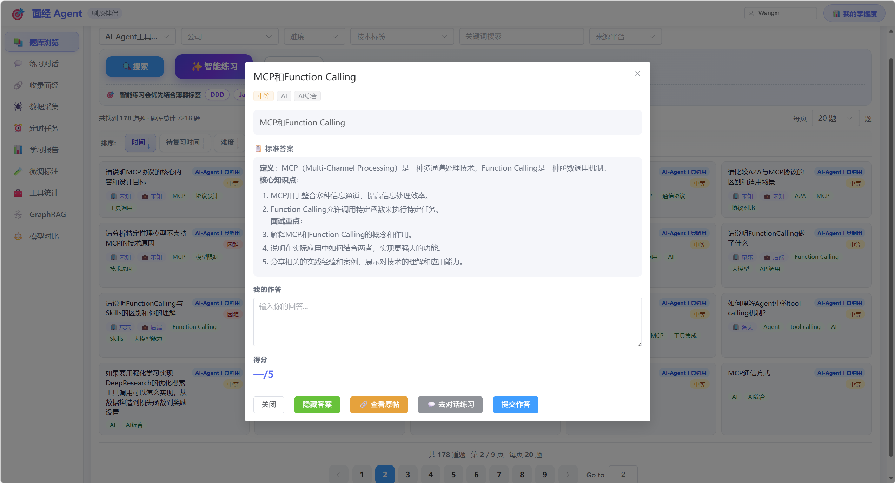
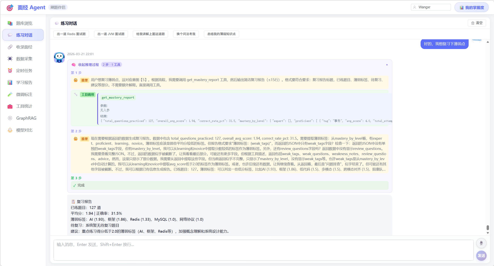

---

## 2) 答题流程与反馈

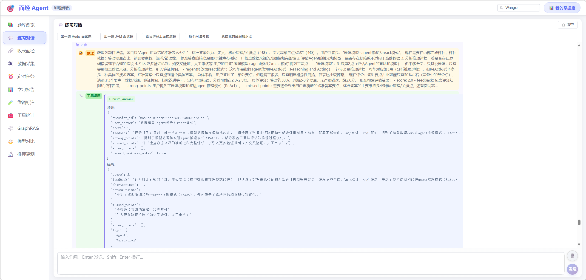
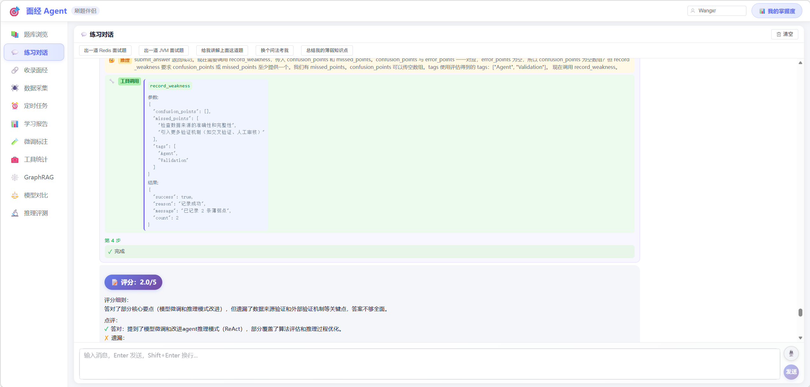
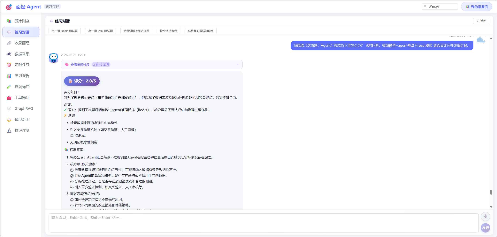
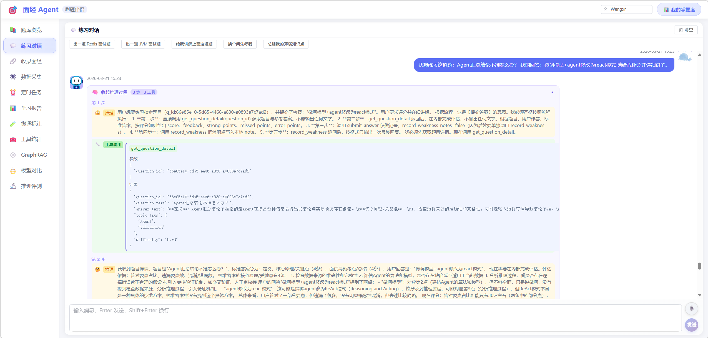

---

## 3) 个性化学习

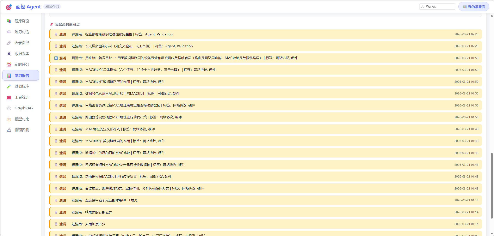
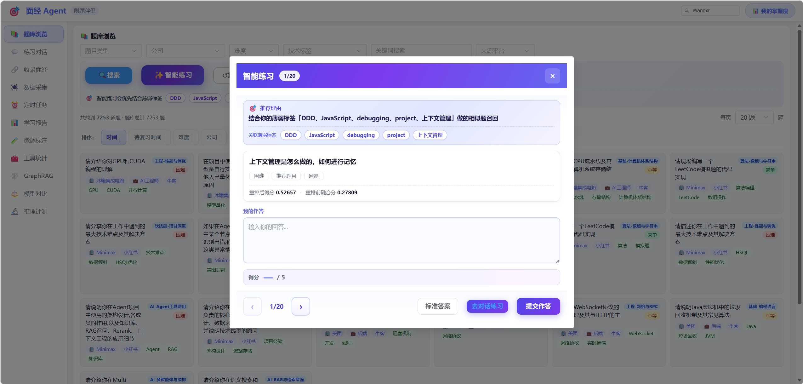
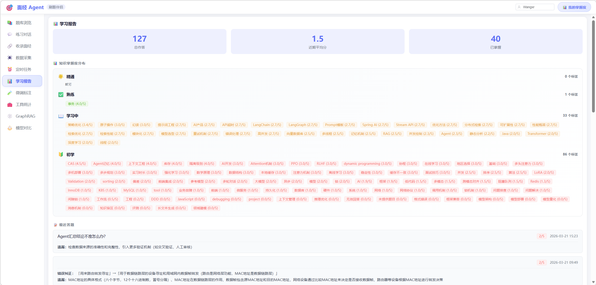

---

## 4) 采集与调度

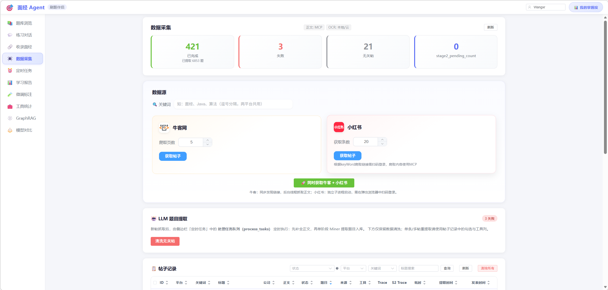
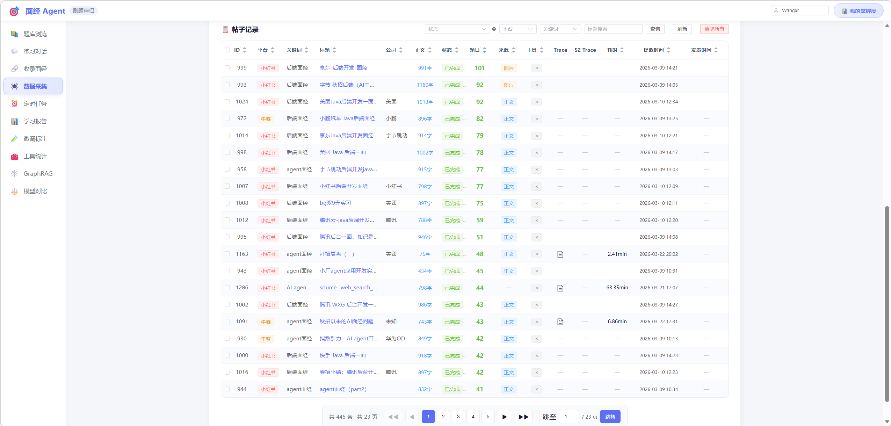
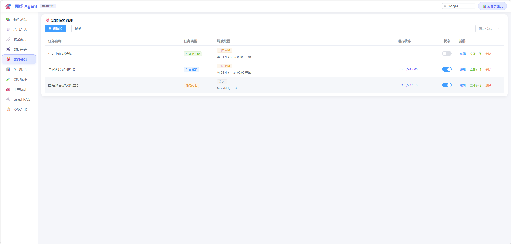

---

## 5) 微调与模型分析

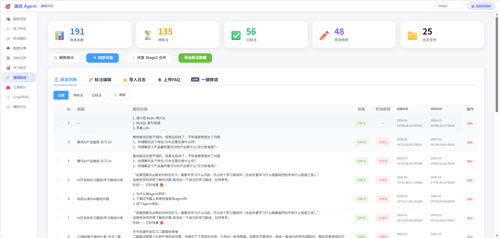
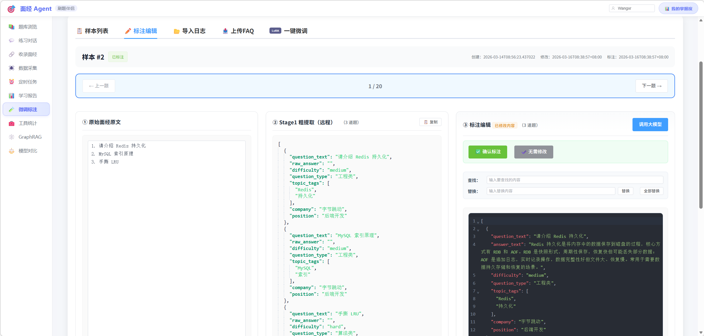
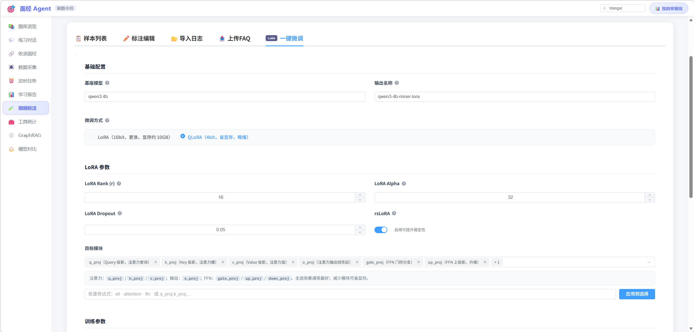
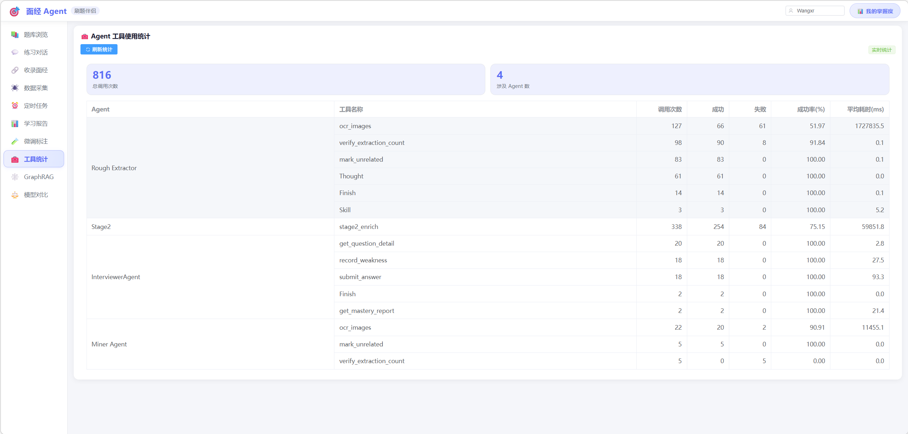
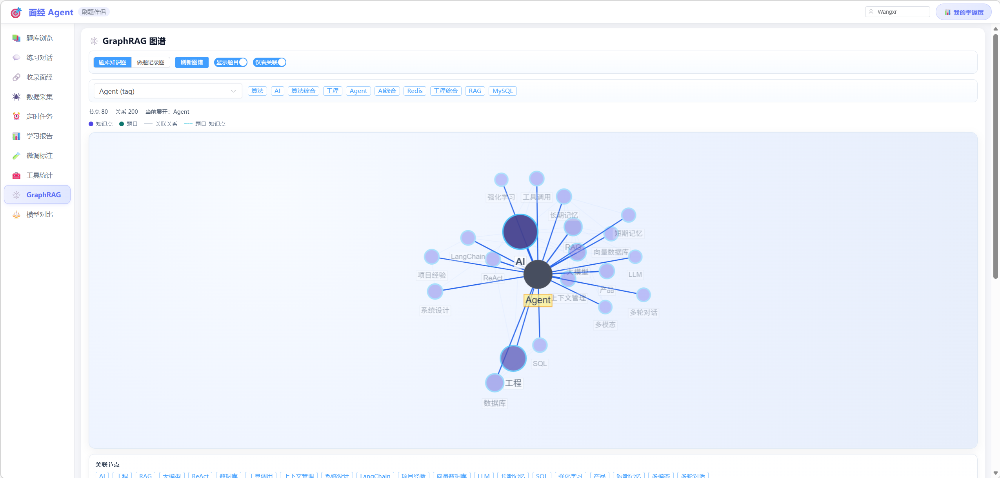
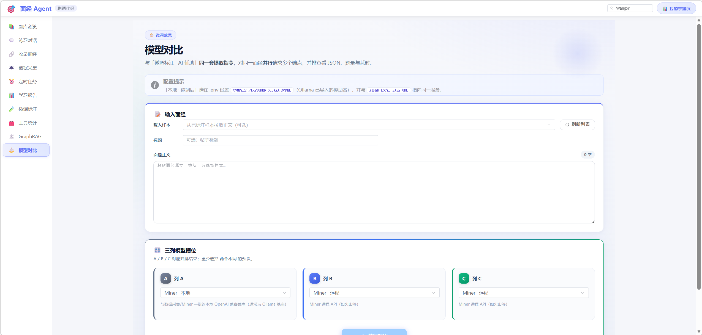

---

## 待补截图（按当前架构）

- `19_收录面经页面.png`（对应 `web/src/views/IngestView.vue`）
