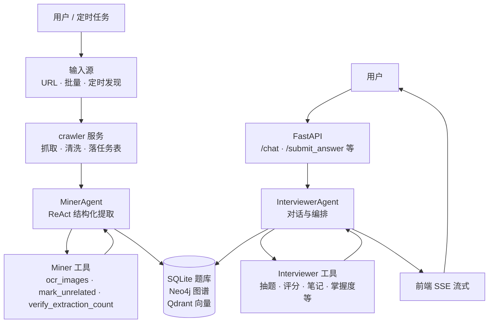
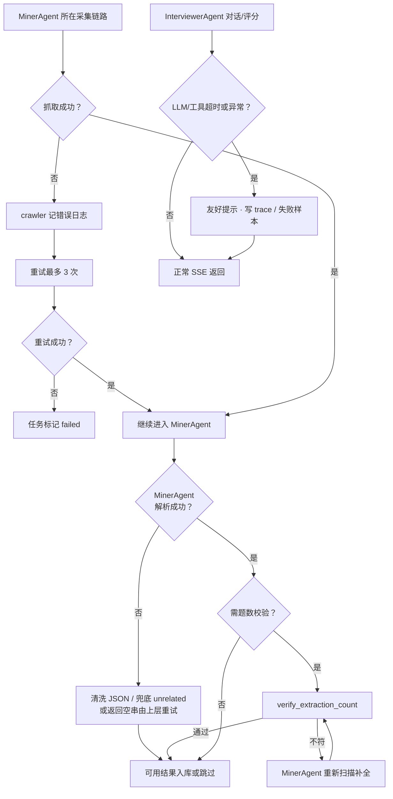
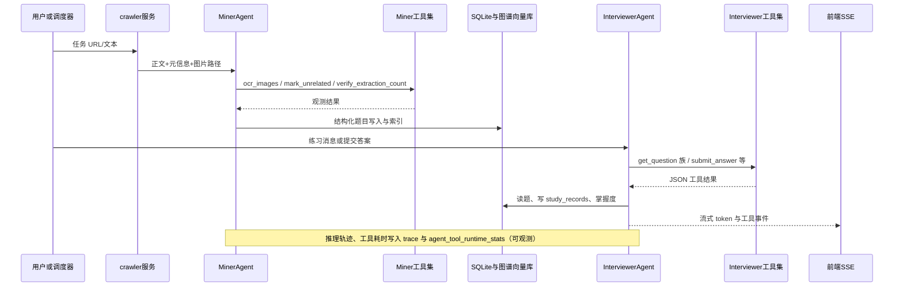
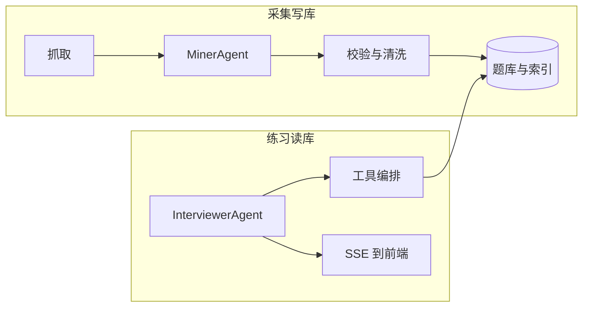
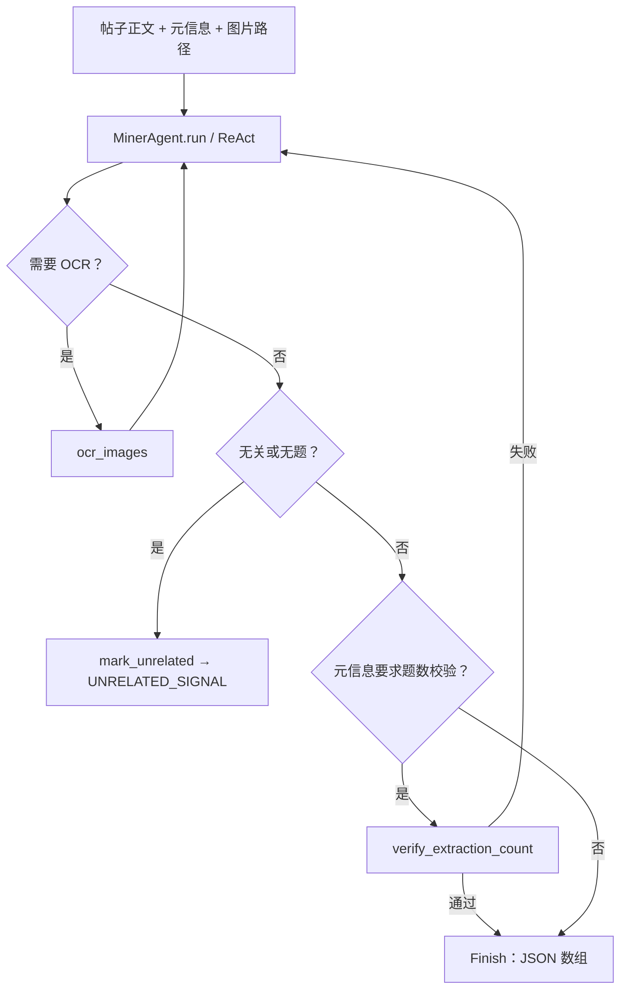
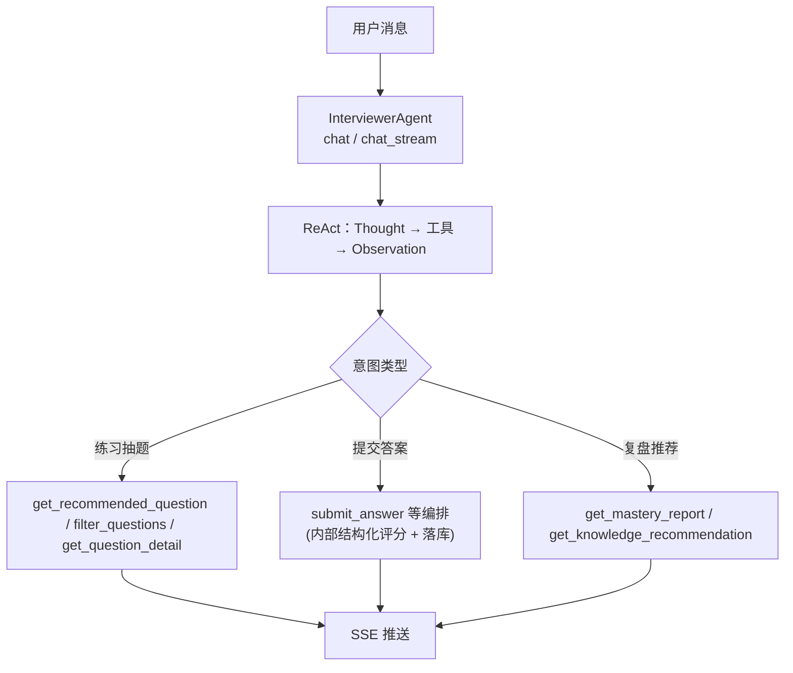

# 更新日期: 2026-05-07

**重构目标（Summary）**

- 0) 丰富基于个人的 AI-coding 经验：引入 SDD、TDD、单元测试覆盖及工程化开发规范；提升可维护性与开发效率。
- 1) Agent 框架选型：评估并确定语言与 Agent 框架（例如 hello-agents / LangChain / 自研 orchestrator），形成可替换方案与迁移步骤。
- 2) 中间件重新选型：队列、缓存、向量引擎、图数据库、观测/追踪中间件的评估与替换计划。
- 3) 数据表与 GraphRAG 重新设计：重构数据模型、索引与 RAG 数据流（向量、图谱、元数据）以支持高并发检索与长期迭代。
- 4) 考虑线上部署与长期迭代：容器化、CI/CD、回滚与监控方案；支持灰度与多环境部署。
- 5) 功能扩展：规划岗位模拟面试与题目出题流水线（题库生成、质量检测、自动标注与评分链路）。

**高优先级待办（Top-level TODO）**

- [ ] 撰写重构目标与范围文档
- [ ] 评估并选定 Agent 框架与语言
- [ ] 中间件选型（队列/缓存/搜索/观测）
- [ ] 数据库与表结构重设计（主库/向量/图谱）
- [ ] 重新设计 GraphRAG 数据流与索引策略
- [ ] 制定线上部署与 CI/CD 方案
- [ ] 设计岗位模拟面试与出题模块
- [ ] 引入 SDD/TDD 流程与覆盖单元测试

# InterviewExperienceCrawlerAgent

面向面试题采集、结构化提取、智能练习与学习追踪的一体化 Agent 系统。  
项目将牛客/小红书等来源内容接入采集链路，经 `MinerAgent` 提取后入库，再由 `InterviewerAgent` 完成对话练习、评分反馈与学习建议。

---

## 项目定位

- **采集侧**：URL 收录、批量抓取、任务队列、重提取、Stage2 精答增强
- **理解侧**：`MinerAgent` + OCR + Schema 约束，输出结构化题目数据
- **练习侧**：`InterviewerAgent` 流式对话、答题评分、复盘反馈、推荐建议
- **存储侧**：SQLite（业务主库）+ Neo4j（知识图谱）+ Qdrant（向量检索）
- **可观测侧**：后端日志、子进程日志、推理轨迹、工具调用统计

---

## 前端效果总览

> 直接看本 README 可快速了解界面；全量图见 [`项目图片总览.md`](项目图片总览.md)。

### 核心业务页面


### 采集、训练与分析页面


### 当前仍建议补充

- `19_收录面经页面.png`（对应 `web/src/views/IngestView.vue`）

---

## 最新系统架构（代码对齐）

```text
前端（Vue 3 + Vite，web/）
  └─ 生产构建到 backend/static/dist
          │
          ▼
FastAPI 主服务（backend/main.py）
  ├─ 题库 / 对话 / 评分 / 收录 / 报告 / 图谱 / 工具统计
  ├─ 采集链路与任务管理（crawler）
  ├─ 微调标注与模型对比接口（finetune / model bench）
  ├─ 定时任务 API（scheduler_api 挂载）
  └─ 推理轨迹 API（reasoning_api 挂载）
          │
          ├─ Agent 层：InterviewerAgent（对话编排）
          ├─ Agent 层：MinerAgent / MinerReActAgent（提取）
          ├─ 服务层：crawler / scheduling / finetune / storage / knowledge
          │
          ├─ SQLite（backend/data/local_data.db）
          ├─ Neo4j（docker compose）
          └─ Qdrant（docker compose）
```

---

## Agent 角色（真实命名）

### `MinerAgent`（采集与提取）

- 从采集内容中抽取题目、标签、知识点等结构化信息
- 支持 OCR 辅助、无关内容终止（`mark_unrelated`）等策略
- 与采集任务、批量重提取、Stage2 精答流程联动

### `InterviewerAgent`（对话与编排）

- 承担练习问答、流式回复、答题评分、学习建议
- 通过工具调用组织记忆、推荐、掌握度等业务能力
- 管理会话上下文与多轮对话编排（`get_orchestrator`）

---

## 双 Agent 协作机制（职责、工具与输出）

两个 Agent **名称固定**：`MinerAgent`（面经挖掘）与 `InterviewerAgent`（练习编排）。下文不使用「AgentA」等占位命名。

### MinerAgent：采集侧结构化提取

| 工具名 | 作用 | 典型触发 |
|--------|------|----------|
| `ocr_images` | 对帖子关联图片做 OCR，把文字补进上下文 | 正文无明显面试题、但有图时 |
| `mark_unrelated` | 将帖子标为无关（广告、求分享、无题等）并结束 | 确认无可用面试题时 |
| `verify_extraction_count` | 校验「提取条数」与元信息中的预期题数是否一致 | 元信息带「原文约 N 道题」时 |
| `Thought` / `Finish` | hello-agents ReAct 内置：思考与提交最终 JSON | 每轮推理与正常收尾 |

**MinerAgent 输出示例（有题，写入题库）**：模型经 `Finish` 或解析后直接给出 **合法 JSON 数组**，元素为题目对象（字段名与 `miner_prompt` 一致）：

```json
[
  {
    "question_text": "请介绍 Redis 的持久化机制（RDB 与 AOF）及各自适用场景",
    "answer_text": "Redis 提供 RDB 快照与 AOF 日志两种持久化……",
    "difficulty": "medium",
    "question_type": "工程-缓存与Redis",
    "topic_tags": ["Redis", "持久化", "RDB", "AOF"],
    "company": "字节跳动",
    "position": "后端工程师"
  }
]
```

**无关帖**：先输出 `{"status":"unrelated","reason":"..."}` 再调 `mark_unrelated`（具体以 `miner_prompt` 为准）；上层会识别 `UNRELATED_SIGNAL`，**不会**把闲聊当成题库 JSON。

### InterviewerAgent：练习侧对话与编排

业务工具由 `get_interviewer_tools()` 注册（代码：`backend/tools/interviewer_tools.py`），与 ReAct 内置 `Thought` / `Finish` 配合。

| 工具名 | 作用 |
|--------|------|
| `get_session_context` | 当前会话练习统计（题量、均分、已练标签等） |
| `get_recommended_question` | 按薄弱点/条件推荐题目列表 |
| `find_similar_questions` | 按题干语义检索相似题 |
| `filter_questions` | 多条件筛选题库 |
| `get_question_detail` | 按 `question_id` 取题干与标准答案 |
| `submit_answer` | 提交用户答案与评分结果并落库（含 SM-2 等） |
| `record_weakness` | 记录混淆点/遗漏点到情景记忆与笔记 |
| `manage_note` | 题目笔记增删改查 |
| `get_mastery_report` | 掌握度、薄弱标签、复习建议 |
| `get_knowledge_recommendation` | 延伸知识点与资源推荐 |
| `analyze_resume` | 更新用户画像（目标岗位、技术栈等） |

**InterviewerAgent 侧「评分卡片」示例**（由 `submit_answer` 链路中的结构化评估生成，经 SSE 推到前端；**不是** Miner 的题库 JSON）：

```json
{
  "score": 4,
  "strong_points": ["能说明 RDB 快照思路", "提到 AOF 追加写"],
  "missed_points": ["未对比持久化对恢复与性能的影响"],
  "suggestion": "可补充 AOF rewrite 与混合持久化策略",
  "reference_answer": "……"
}
```

---

## 主流程（端到端）



---

## 异常与回退流程（含 Agent 名称）



---

## 数据流与日志流



---

## MCP 服务层（可选扩展）

仓库 `mcp/` 下提供 **3 个 MCP**，用于在 Cursor 等环境中扩展「抓内容 / 抓网页 / 抽图片」能力；**主站业务默认走后端 FastAPI + 内置爬虫**，MCP 为可选集成。

| MCP | 语言 | 主要工具 | 依赖后端 | 可独立部署 |
|-----|------|----------|----------|------------|
| `mcp-content-extractor` | Python | `extract_nowcoder_content`、`extract_xhs_content`、`extract_content` | 是（爬虫与登录态） | 否 |
| `mcp-content-fetcher` | TypeScript | `fetch_content`、`fetch_multiple_contents` | 否 | 是 |
| `mcp-image-extractor` | TypeScript | 按文件/URL/Base64 抽图与压缩 | 否 | 是 |

详细配置、Smithery 与排障见 [`docs/MCP服务详解.md`](docs/MCP服务详解.md)、[`docs/MCP构建与部署指南.md`](docs/MCP构建与部署指南.md)。

---

## 处理流程逻辑（总览）



### MinerAgent 单链路（提取）



### InterviewerAgent 单链路（对话与评分）



---

## 前端页面（当前侧边栏）

`web/src/App.vue` 中当前导航项：

- `browse`：`BrowseView.vue`（题库浏览）
- `chat`：`ChatView.vue`（练习对话）
- `ingest`：`IngestView.vue`（收录面经）
- `collect`：`CollectView.vue`（数据采集）
- `scheduler`：`SchedulerView.vue`（定时任务）
- `report`：`ReportView.vue`（学习报告）
- `finetune`：`FinetuneView.vue`（微调标注）
- `tool_usage`：`ToolUsageView.vue`（工具统计）
- `graph_rag`：`GraphRagView.vue`（GraphRAG）
- `model_compare`：`ModelBenchView.vue`（模型对比）

---

## 核心能力清单

- **题库管理**：筛选、分页、随机抽题、智能组题
- **对话练习**：SSE 流式问答，支持会话历史
- **答题评估**：异步/流式评分、学习反馈、记录沉淀
- **采集链路**：抓取、清洗、提取、批量重提取、任务可视化
- **定时调度**：APScheduler 可视化管理，支持运行/启停/CRUD
- **微调流程**：样本标注、训练数据生成、模型对比评测
- **知识图谱与推荐**：Neo4j 图谱、Qdrant 向量检索、学习建议

---

## 快速开始

### 1) 环境要求

- Python 3.12+
- Conda 环境：`NewCoderAgent`
- Docker Desktop（Neo4j / Qdrant）
- Node.js（前端开发模式）

### 2) 安装依赖

```bash
cd E:\Agent\AgentProject\wxr_agent
copy .env.example .env
conda activate NewCoderAgent
pip install -r requirements.txt
python -m spacy download zh_core_web_sm
python -m spacy download en_core_web_sm
```

### 3) 启动基础服务

```bash
docker compose up -d
```

### 4) 启动后端

```bash
python run.py
```

### 5) 启动前端（开发模式）

```bash
cd web
npm install
npm run dev
```

### 6) 访问地址

- API：<http://localhost:8000>
- Swagger：<http://localhost:8000/docs>
- 前端开发：<http://localhost:5173>
- Neo4j：<http://localhost:7474>
- Qdrant：<http://localhost:6333/dashboard>

---

## API 入口（高频）

- `GET /api/config`：运行配置
- `GET /api/questions`：题库查询
- `GET /api/questions/smart-practice`：智能练习组题
- `POST /api/chat/stream`：流式对话
- `POST /api/submit_answer/stream`：流式评分
- `POST /api/ingest`：URL 收录
- `GET /api/crawler/stats`：采集统计
- `GET/POST /api/scheduler/*`：定时任务管理
- `GET/POST /api/finetune/*`：微调与模型对比
- `GET /api/reasoning/*`：推理轨迹查询

更完整接口文档见 [`docs/系统梳理/API全量文档.md`](docs/系统梳理/API全量文档.md)。

---

## 目录结构（精简版）

```text
InterviewExperienceCrawlerAgent/
├─ backend/
│  ├─ main.py
│  ├─ api/                  # scheduler_api / reasoning_api
│  ├─ agents/               # interviewer_agent / miner_agent / miner_react_agent
│  ├─ services/             # crawler / scheduling / storage / finetune / knowledge
│  ├─ tools/
│  ├─ config/config.py
│  └─ data/                 # local_data.db / neo4j_data / qdrant_storage / logs 等
├─ web/                     # Vue3 + Vite
├─ docs/                    # 系统梳理与使用文档
├─ 微调/                    # 训练脚本与产物
├─ docker-compose.yml
├─ run.py
└─ requirements.txt
```

---

## 配置说明

- 配置来源：项目根目录 `.env`
- 配置读取：`backend/config/config.py`
- 支持本地/远程 LLM 双模式（`LLM_MODE=local|remote`）
- 推荐先参考：
  - [`docs/STARTUP_GUIDE.md`](docs/STARTUP_GUIDE.md)
  - [`docs/环境配置说明.md`](docs/环境配置说明.md)

---

## 文档导航

- 文档索引：[`docs/README.md`](docs/README.md)
- 页面功能说明：[`docs/系统梳理/页面功能与按钮说明.md`](docs/系统梳理/页面功能与按钮说明.md)
- Agent 全景：
  - [`docs/系统梳理/Agent-Interviewer全景文档.md`](docs/系统梳理/Agent-Interviewer全景文档.md)
  - [`docs/系统梳理/Agent-Miner全景文档.md`](docs/系统梳理/Agent-Miner全景文档.md)
- 模型对比：[`docs/系统梳理/模型对比页面说明.md`](docs/系统梳理/模型对比页面说明.md)
- MCP 与扩展：
  - [`docs/MCP服务详解.md`](docs/MCP服务详解.md)
  - [`docs/MCP构建与部署指南.md`](docs/MCP构建与部署指南.md)

---

## 常见问题

### 1) 为什么 `python run.py` 仍提示环境问题？

`run.py` 会尝试切换到固定的 `NewCoderAgent` 解释器路径；若路径变化，请修改 `run.py` 中的 `CONDA_ENV_PYTHON`。

### 2) Neo4j / Qdrant 连接失败怎么办？

优先检查：

- `docker compose ps`
- `docker compose logs neo4j`
- `docker compose logs qdrant`

并确认 `.env` 中连接地址与 `docker-compose.yml` 端口一致。

### 3) 页面能打开但流式卡住怎么办？

先用直连后端方式排查：前端设置 `VITE_STREAM_DIRECT=true`，绕过代理缓存验证 SSE。

---

## 致谢

- [hello-agents](https://github.com/datawhalechina/hello-agents)
- [DataWhale](https://datawhale.club)
- 火山引擎 / 阿里云 / Ollama 等模型与基础设施能力
