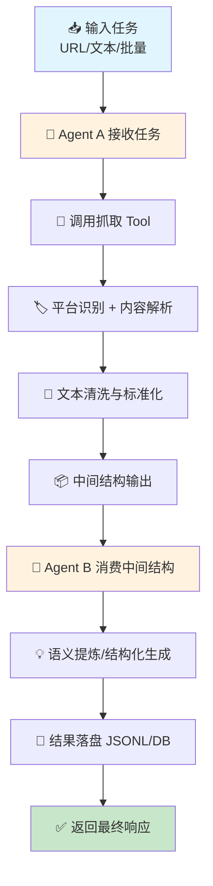
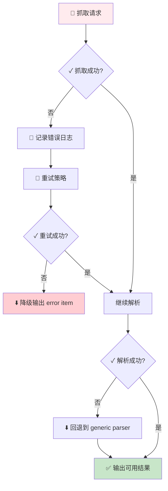
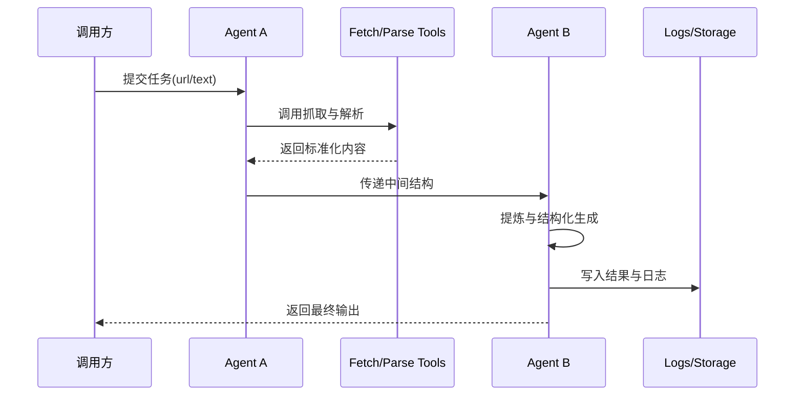

# wxr_agent：智能面经采集与处理系统

> 基于双 Agent 协作的面经智能处理平台。自动采集牛客/小红书面经，通过结构化处理、知识图谱构建、SM-2 算法追踪，提供 AI 面试对话练习与个性化复习方案。

---

## 📋 项目概述

`wxr_agent` 是一个面向"内容采集 + 智能处理 + 结构化输出"的 Agent 系统，核心目标是将原始网页/文本数据转化为可复用的知识结果（结构化 JSON、训练日志、可追溯记录等）。

项目围绕 **双 Agent 协作机制** 构建：

- **Agent A（采集与预处理 Agent）**：负责内容抓取、平台识别、文本清洗、标准化输出
- **Agent B（理解与生成 Agent）**：负责语义提炼、结构化生成、结果落盘、日志记录

二者通过明确的任务边界和工具调用链路，实现"可扩展、可追踪、可调优"的自动化处理流程。

---

## ⚙️ 快速开始

### 环境要求

| 组件 | 版本 / 要求 |
|------|------------|
| Python | 3.12+ |
| Conda 环境 | `NewCoderAgent` |
| Docker Desktop | 需运行（用于本地 Neo4j） |
| 操作系统 | Windows 10/11（已测试） |

### 启动步骤

```bash
# 1. 进入项目目录
cd E:\Agent\AgentProject\wxr_agent

# 2. 配置环境变量（复制示例并填入 API Key / Neo4j 密码 / Qdrant 等）
copy .env.example .env

# 3. 安装依赖（建议使用 Conda 环境 NewCoderAgent）
conda activate NewCoderAgent
pip install -r requirements.txt
python -m spacy download zh_core_web_sm
python -m spacy download en_core_web_sm

# 4. 启动 Neo4j + Qdrant（本地 Docker，数据卷见 docker-compose.yml）
docker compose up -d

# 5. 启动后端（Windows 下 run.py 可自动切到 NewCoderAgent 的解释器，见 run.py 顶部说明）
python run.py
```

启动成功后访问：
- **后端 API**：http://localhost:8000
- **API 文档**：http://localhost:8000/docs
- **前端（生产）**：构建 `web` 后由后端托管同端口（`backend/static/dist`）
- **前端（开发）**：`cd web && npm run dev` → http://localhost:5173

更细的排障与顺序说明见 [`docs/STARTUP_GUIDE.md`](docs/STARTUP_GUIDE.md)。

---

## 🏗️ 系统架构

```
┌────────────────────────────────────────────────────────────┐
│  前端 (Vue 3 + Vite)  web/  →  生产构建 backend/static/dist │
└────────────────────────────┬───────────────────────────────┘
                             │ HTTP
┌────────────────────────────▼───────────────────────────────┐
│           FastAPI 主应用 (backend/main.py)                 │
│  · REST / SSE（对话、评分、爬虫、微调、调度、推理追踪）      │
│  · APScheduler 定时发现与队列处理（backend/services/       │
│    scheduling/）                                            │
│  · 静态资源 /post-images（帖子图片）                        │
├────────────────────────────────────────────────────────────┤
│  InterviewerAgent（backend/agents/interviewer_agent.py）   │
│  ReAct 对话 + 会话/收录/评分等业务编排（含 get_orchestrator） │
├────────────────────────────────────────────────────────────┤
│  采集与提取链路                                             │
│  · task_executor.execute() 统一按钮/定时入口               │
│  · question_extractor / Miner（ReAct + OCR，可选 two_stage）│
│  · stage2_processor：Stage2 富化队列（火山等，可进程/线程）   │
│  · 可选 MCP：正文抓取、图片 OCR（见 .env CRAWLER_SOURCE 等） │
└────────────────────────────┬───────────────────────────────┘
     ┌───────────────────────┼───────────────────────┐
     ▼                       ▼                       ▼
┌─────────────┐      ┌─────────────┐      ┌──────────────────┐
│ Neo4j       │      │ Qdrant      │      │ SQLite + 文件目录 │
│ 知识图谱     │      │ 向量记忆     │      │ backend/data/    │
│ :7687       │      │ :6333       │      │ local_data.db 等 │
└─────────────┘      └─────────────┘      └──────────────────┘
```

**说明**：Neo4j 与 Qdrant 均可通过根目录 `docker compose` 在本地启动；向量与记忆相关配置见 `.env` 中 `QDRANT_*`、`NEO4J_*`。SQLite 默认路径为 `backend/data/local_data.db`（可用 `DATA_DIR` / `SQLITE_DB_PATH` 覆盖）。

---

## 🤖 双 Agent 协作机制

### Agent A：采集与预处理 Agent

**职责：**
- 接收任务输入（URL / 文本 / 批量项）
- 调用抓取 Tool 获取原始内容
- 平台识别（牛客 / 小红书 / 通用网页）
- 文本清洗、降噪、字段标准化
- 输出统一中间结构（供 Agent B 消费）

**输出示例（中间态）：**
```json
{
  "url": "https://www.nowcoder.com/discuss/...",
  "title": "字节跳动 Java 面经",
  "platform": "nowcoder",
  "raw_content": "...",
  "clean_content": "...",
  "metadata": {
    "company": "字节跳动",
    "position": "Java 后端",
    "difficulty": "hard"
  }
}
```

### Agent B：理解与生成 Agent

**职责：**
- 消费 Agent A 的标准化中间结果
- 执行语义提炼、信息归类、标签化
- 结构化生成（题目、知识点、答案等）
- 组织最终输出（JSONL / 持久化存储 / 回传响应）
- 写入处理日志（trace + prompt + result）

**输出特征：**
- 面向下游可直接消费
- 保留来源和处理时间戳
- 保证可追溯（任务 ID、阶段日志、异常上下文）

---

## 🔄 处理流程逻辑

### 主流程（端到端）



### 异常与回退流程



### 数据流与日志流



---

## 🛠️ Tool 实现设计

项目采用"Tool 原子能力 + Agent 编排"的模式，核心 Tool 分为以下几类：

### 内容获取类 Tool

**`fetch_content(url)`**
- 单链接抓取 + 解析
- 统一请求超时（10s）
- 统一 UA，减少站点拦截概率

**`fetch_multiple_contents(urls)`**
- 批量并行抓取（失败隔离）
- 单条失败不影响整体
- 返回成功/失败统计

### 平台解析类 Tool

**`detectPlatform(url)`**
- 根据 URL 特征识别平台
- 支持：牛客、小红书、通用网页

**`parseNowcoder(html, url)`**
- 牛客定制解析
- 提取：标题、公司、岗位、难度、内容

**`parseXiaohongshu(html, url)`**
- 小红书定制解析
- 提取：标题、话题、内容、互动数据

**`parseGeneric(html, url)`**
- 通用网页回退解析
- 基于 DOM 结构和启发式规则

**设计要点：**
- 优先定制解析，失败时自动回退通用解析
- 保持统一输出 schema，降低下游复杂度

### 处理与输出类 Tool

**`cleanText(raw_text)`**
- 去噪、裁剪、空白规整
- 移除 HTML 标签、特殊字符
- 保留关键格式（换行、列表）

**`structureOutput(parsed_data)`**
- 结果封装为 JSON 文本块
- 验证必填字段
- 添加元数据（处理时间、版本等）

**`logProcessing(task_id, stage, input, output, metadata)`**
- 日志落盘（便于微调与故障复盘）
- 记录：Prompt、Response、耗时、Token 消耗
- 支持按任务 ID 追踪完整链路

---

## 📁 目录结构

```
wxr_agent/
├── llm_observability/          # LLM 可观测性脚本与手册
├── mcp/                          # MCP 服务（content-extractor / fetcher / image-extractor）
├── run.py                        # 后端启动（可自动指向 NewCoderAgent 解释器）
├── docker-compose.yml            # 本地 Neo4j + Qdrant
├── requirements.txt
├── .env                          # 运行时配置（勿提交密钥）
│
├── backend/
│   ├── main.py                   # FastAPI 入口、大部分 REST/SSE 路由
│   ├── config/config.py          # 从环境变量读取的统一配置
│   ├── api/
│   │   ├── scheduler_api.py      # /api/scheduler/* 定时任务 CRUD
│   │   └── reasoning_api.py      # /api/reasoning/* 推理会话查询
│   ├── agents/
│   │   ├── interviewer_agent.py  # 面试主 Agent + 编排（get_orchestrator）
│   │   ├── miner_agent.py        # 题目提取 Agent（基础实现）
│   │   ├── miner_react_agent.py  # Miner ReAct 封装
│   │   ├── miner_agent_v3.py     # 提取变体
│   │   ├── two_stage_miner_agent.py
│   │   ├── prompts/              # Interviewer / Miner 等提示词
│   │   └── schemas/              # Miner JSON schema
│   ├── services/
│   │   ├── crawler/              # 牛客/小红书爬取、任务执行、OCR 适配
│   │   ├── scheduling/           # APScheduler、子进程 worker（批量提取 / process_tasks / stage2）
│   │   ├── storage/              # SQLite、Neo4j、推理轨迹、会话存储
│   │   ├── knowledge/            # 知识管理（KnowledgeManager）
│   │   ├── stage2_processor.py # Stage2 队列消费
│   │   ├── finetune/             # 微调样本与导入
│   │   ├── warmup/               # LLM / Embedding / Rerank 预热
│   │   └── ...                   # rerank、多路召回推荐等
│   ├── tools/
│   │   ├── hunter_tools.py
│   │   ├── interviewer_tools.py
│   │   ├── miner_tools.py
│   │   └── knowledge_manager_tools.py
│   ├── llm/                      # 流式与 DeepSeek 适配等
│   └── data/                     # 默认数据根（库文件、post_images、neo4j/qdrant 卷映射等）
│
├── 微调/
│   ├── llm_logs/                 # 训练/对比日志（如 miner_two_stage_log.jsonl）
│   └── labeled_data.jsonl
│
└── web/                          # Vue 3 + Vite（build → backend/static/dist）
```

**查阅 DeepSeek 流式 / 参数矩阵 / 适配层说明**：打开 [`llm_observability/README.md`](llm_observability/README.md)（完整手册在 `llm_observability/docs/deepseek-streaming-guide.md`）。原 `docs/DeepSeek流式输出与参数组合分析.md` 已改为迁移指针。

---

## 📊 数据流与日志

### 日志类型

| 日志类型 | 存储位置 | 用途 |
|---------|---------|------|
| **Task Log** | `微调/llm_logs/` | 任务生命周期（开始/结束/耗时） |
| **Tool Log** | `微调/llm_logs/` | 每个 Tool 的输入输出摘要 |
| **Error Log** | `微调/llm_logs/` | 异常堆栈 + 上下文 |
| **LLM Log** | `微调/llm_logs/llm_prompt_log.jsonl` | Prompt/Response（脱敏后） |
| **Platform Log** | `微调/llm_logs/nowcoder_*.jsonl` 等 | 按平台分类的处理结果 |

### 日志示例

```jsonl
{"task_id": "task_001", "stage": "fetch", "url": "https://...", "status": "success", "duration_ms": 1234}
{"task_id": "task_001", "stage": "parse", "platform": "nowcoder", "extracted_fields": 8, "status": "success"}
{"task_id": "task_001", "stage": "llm_process", "prompt_tokens": 512, "response_tokens": 256, "status": "success"}
```

---

## 🔌 主要 API 接口（节选）

| 方法 | 路径 | 说明 |
|------|------|------|
| `GET` | `/api/config` | 前端运行配置（用户、爬虫/OCR 来源等） |
| `GET` | `/api/questions` | 题库筛选分页 |
| `GET` | `/api/questions/random` | 随机一题 |
| `GET` | `/api/questions/smart-practice` | 智能组题 |
| `GET` | `/api/questions/meta` | 公司、标签、岗位等元数据 |
| `POST` | `/api/chat` | 对话（非流式） |
| `POST` | `/api/chat/stream` | 对话（SSE 流式） |
| `POST` | `/api/submit_answer` | 异步评分 + SM-2 |
| `POST` | `/api/submit_answer/stream` | 评分 SSE |
| `POST` | `/api/ingest` | URL 收录进采集链路 |
| `GET` | `/api/user/{id}/mastery` | 掌握度 |
| `GET` | `/api/user/{id}/reviews` | SM-2 复习队列 |
| `GET` | `/api/resources` | 学习资源 |
| `GET` / `POST` | `/api/crawler/*` | 发现、处理队列、重提取、任务列表等 |
| `GET` / `POST` | `/api/finetune/*` | 微调样本与导入导出 |
| `GET` / `POST` / `PUT` / `DELETE` | `/api/scheduler/*` | 可视化定时任务 |
| `GET` | `/api/reasoning/*` | 推理轨迹会话查询 |

笔记、推荐题等能力主要通过 **Interviewer 工具**（如 `manage_note`）在对话中调用，不一定对应独立 REST 路径。

**完整清单**：[`docs/系统梳理/API全量文档.md`](docs/系统梳理/API全量文档.md)；交互式文档：http://localhost:8000/docs

---

## 🚀 可扩展性

### 新平台支持

1. 在 `backend/tools/hunter_tools.py` 新增 `parseXXX()` 函数
2. 在 `detectPlatform()` 中注册 URL 检测规则
3. 定义统一输出 schema

### 新处理策略

在 Agent B 中新增策略节点，无需修改 Agent A 或 Tool 层。

### 新输出目标

追加写库/消息队列/向量库适配层，保持 Tool 接口不变。

---

## 📈 稳定性建议

- **批处理并发限流**：避免被站点封禁
- **超时 + 重试 + 熔断**：提升容错能力
- **结果 schema 校验**：避免脏数据进入下游
- **全链路日志**：便于故障复盘与数据沉淀

---

## ❓ 常见问题

### Q: 如何配置默认用户和 Agent 步数？
在 `.env` 中添加：
- `DEFAULT_USER_ID=user_001`
- `INTERVIEWER_MAX_STEPS=8`

### Q: `MemoryTool 初始化失败`
确认项目根目录存在 `.env` 文件，且 `backend/main.py` 开头有 `load_dotenv(override=True)`。

### Q: Neo4j 连不上
确认 `docker compose up -d` 已启动，并在 **`.env`** 中设置 `NEO4J_URI=bolt://localhost:7687` 及与 `docker-compose.yml` 中 `NEO4J_AUTH` 一致的密码。

### Q: Docker 拉取镜像失败（代理问题）
检查 Windows IE 代理注册表：
```powershell
Get-ItemProperty "HKCU:\Software\Microsoft\Windows\CurrentVersion\Internet Settings" | Select ProxyEnable, ProxyServer
Set-ItemProperty "HKCU:\Software\Microsoft\Windows\CurrentVersion\Internet Settings" -Name ProxyEnable -Value 0
```

### Q: `SetLimitExceeded (429)` LLM 限流
进入火山引擎控制台 → 模型推理 → 在线推理 → 关闭「安全体验模式」或提升推理配额。

### Q: 开发模式（代码改动自动重启）
```bash
python run.py --reload
```

---

## 📚 功能概览

| 模块 | 功能 |
|------|------|
| **题库浏览** | 按公司、难度、标签、关键词筛选题目；随机抽题 |
| **面试对话** | 与 AI 面试官实时对话，支持换个问法、举一反三 |
| **答题评测** | 提交答案后获得评分（0-5）、强弱点分析、AI 解析 |
| **掌握度追踪** | SM-2 算法计算复习周期，弱点标签自动识别 |
| **知识推荐** | 针对薄弱点推荐学习资源和知识章节 |
| **记忆系统** | hello-agents 四层记忆持久化对话上下文 |
| **面经收录** | 输入牛客/小红书帖子 URL，自动采集并入库 |
| **笔记功能** | 对任意题目添加个人笔记 |

---

## 🙏 致谢

- [hello-agents](https://github.com/datawhalechina/hello-agents)：Agent 框架
- [DataWhale](https://datawhale.club)：开源社区
- 火山引擎 Doubao / 阿里云 DashScope：LLM & Embedding 服务
