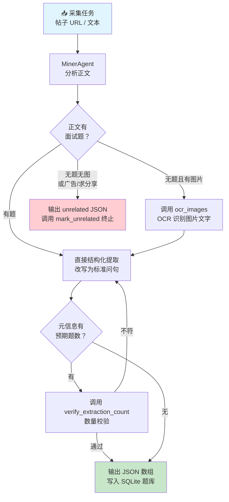
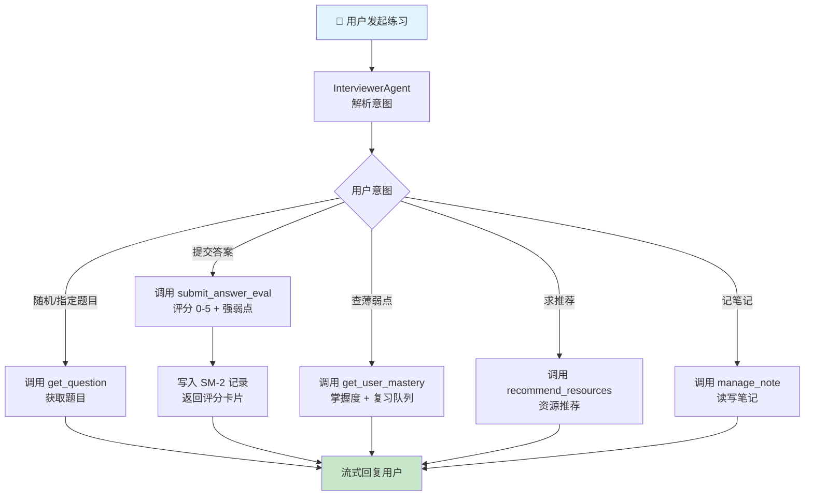
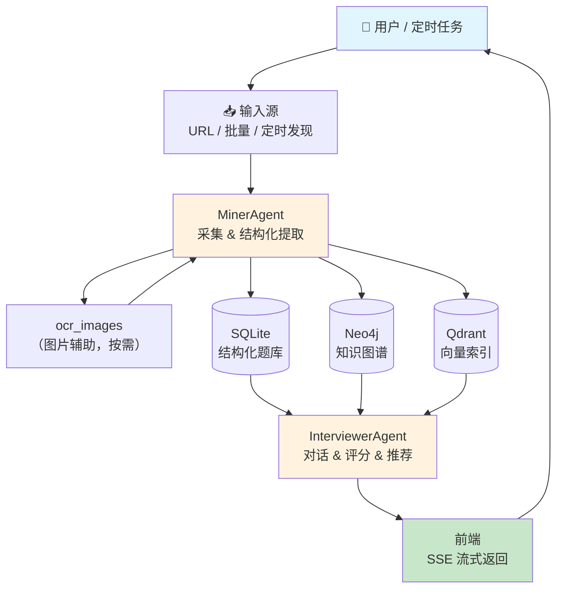
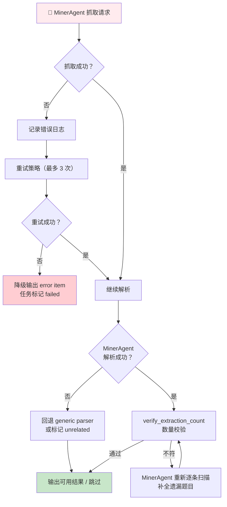
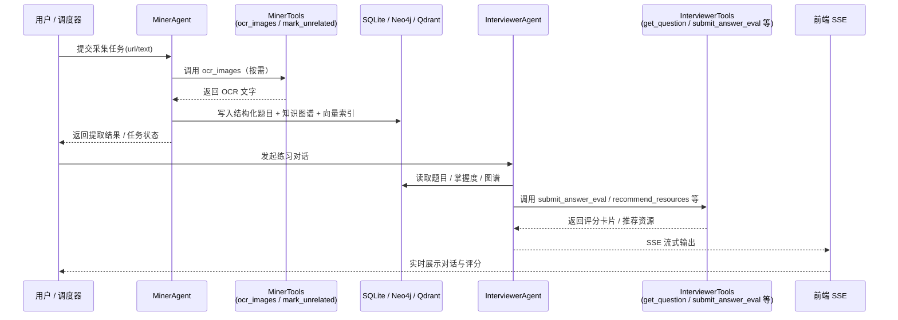

# InterviewExperienceCrawlerAgent

面向面试题采集、结构化提取、智能练习与学习追踪的一体化 Agent 系统。  
项目将牛客/小红书等来源内容接入采集链路，经 `MinerAgent` 提取后入库，再由 `InterviewerAgent` 完成对话练习、评分反馈与学习建议。

---

## 项目定位

- **采集侧**：URL 收录、批量抓取、任务队列、重提取、Stage2 精答增强
- **理解侧**：`MinerAgent` + OCR + Schema 约束，输出结构化题目数据
- **练习侧**：`InterviewerAgent` 流式对话、答题评分、复盘反馈、推荐建议
- **存储侧**：SQLite（业务主库）+ Neo4j（知识图谱）+ Qdrant（向量检索）
- **可观测侧**：后端日志、子进程日志、推理轨迹、工具调用统计

---

## 前端效果总览

> 直接看本 README 可快速了解界面；全量图见 [`GALLERY.md`](GALLERY.md)。

### 核心业务页面


### 采集、训练与分析页面


---

## 系统架构

```text
┌─────────────────────────────────────────────────────────────┐
│          前端（Vue 3 + Vite，web/）                          │
│  BrowseView / ChatView / IngestView / CollectView /         │
│  SchedulerView / ReportView / FinetuneView /                │
│  ToolUsageView / GraphRagView / ModelBenchView              │
└──────────────────────────┬──────────────────────────────────┘
                           │ HTTP / SSE
┌──────────────────────────▼──────────────────────────────────┐
│          FastAPI 主服务（backend/main.py）                   │
│  题库 / 对话 / 评分 / 收录 / 报告 / 图谱 / 工具统计          │
│  scheduler_api  ·  reasoning_api  ·  finetune API           │
│  APScheduler 定时任务  ·  静态资源 /post-images              │
├──────────────────────────────────────────────────────────────┤
│                      Agent 层                                │
│  ┌──────────────────────┐  ┌──────────────────────────────┐ │
│  │    MinerAgent        │  │      InterviewerAgent        │ │
│  │  采集 & 结构化提取    │  │    对话 & 评分 & 推荐编排     │ │
│  └──────────────────────┘  └──────────────────────────────┘ │
├──────────────────────────────────────────────────────────────┤
│                     服务层                                   │
│  crawler · scheduling · storage · knowledge · finetune      │
│  rerank · multi_recall_recommender · warmup                 │
├──────────────────────────────────────────────────────────────┤
│                     MCP 服务层（可选扩展）                    │
│  mcp-content-extractor（Python·stdio）                      │
│  mcp-content-fetcher  （TypeScript·stdio/独立）              │
│  mcp-image-extractor  （TypeScript·stdio/独立）              │
├─────────────────────────┬──────────────────┬────────────────┤
│  SQLite                 │  Neo4j           │  Qdrant        │
│  local_data.db          │  知识图谱 :7687   │  向量 :6333    │
└─────────────────────────┴──────────────────┴────────────────┘
```

---

## 双 Agent 协作机制

### MinerAgent（采集与结构化提取）

**职责**：从采集内容中抽取结构化面试题，写入题库。

**核心工具**：

| 工具 | 说明 |
|------|------|
| `ocr_images` | 对帖子图片做 OCR，正文无题时调用 |
| `mark_unrelated` | 标记帖子为无关（广告/求分享等），终止提取 |
| `verify_extraction_count` | 校验提取数量与原文预期数量是否一致 |

**输出示例**（写入 SQLite `questions` 表）：

```json
[
  {
    "question_text": "请介绍 Redis 的持久化机制（RDB 与 AOF）及各自适用场景",
    "answer_text": "Redis 有 RDB 和 AOF 两种持久化方式……",
    "difficulty": "medium",
    "question_type": "工程-缓存与Redis",
    "topic_tags": ["Redis", "持久化", "RDB", "AOF"],
    "company": "字节跳动",
    "position": "后端工程师"
  }
]
```

**处理流程**：



---

### InterviewerAgent（对话与编排）

**职责**：驱动面试练习对话、评分、学习建议与知识推荐。

**核心工具**：

| 工具 | 说明 |
|------|------|
| `get_question` | 按条件抽取题目（公司/标签/难度/随机） |
| `submit_answer_eval` | 提交答案，返回评分（0-5）、强弱点、AI 解析 |
| `manage_note` | 添加/查看题目个人笔记 |
| `get_user_mastery` | 查询用户掌握度与 SM-2 复习队列 |
| `recommend_resources` | 根据薄弱标签推荐学习资源 |
| `search_knowledge` | 向量检索 Qdrant 知识库 |
| `query_graph` | 查询 Neo4j 知识图谱关联关系 |
| `save_memory` / `load_memory` | 四层记忆读写（hello-agents） |

**输出示例**（评分卡片）：

```json
{
  "score": 4,
  "strengths": ["理解 RDB 快照机制", "知道 AOF 实时写入"],
  "weaknesses": ["未提到 AOF 重写机制", "未对比两种方式的性能差异"],
  "suggestion": "建议补充 AOF rewrite 触发条件及 mixed 持久化策略",
  "reference_answer": "……"
}
```

**处理流程**：



---

## 处理流程逻辑

### 主流程（端到端）



### 异常与回退流程



### 数据流与日志流



---

## MCP 服务层

`mcp/` 目录包含 3 个 MCP (Model Context Protocol) 服务，按需扩展 Agent 能力：

| MCP | 语言 | 工具 | 部署方式 | 独立部署 |
|-----|------|------|---------|--------|
| `mcp-content-extractor` | Python | `extract_nowcoder_content` / `extract_xhs_content` / `extract_content` | stdio 子进程 | ❌（依赖后端爬虫） |
| `mcp-content-fetcher` | TypeScript | `fetch_content` / `fetch_multiple_contents` | stdio / 独立 | ✅ npm / Docker / Smithery |
| `mcp-image-extractor` | TypeScript | `extract_image_from_file` / `extract_image_from_url` / `extract_image_from_base64` | stdio / 独立 | ✅ npm / Docker / Smithery |

### Cursor 配置示例

```json
{
  "mcpServers": {
    "content-extractor": {
      "command": "python",
      "args": ["mcp/mcp-content-extractor/server.py"],
      "cwd": "e:/Agent/AgentProject/wxr_agent"
    },
    "content-fetcher": {
      "command": "node",
      "args": ["mcp/mcp-content-fetcher/dist/index.js"],
      "cwd": "e:/Agent/AgentProject/wxr_agent"
    },
    "image-extractor": {
      "command": "node",
      "args": ["mcp/mcp-image-extractor/dist/index.js"],
      "cwd": "e:/Agent/AgentProject/wxr_agent"
    }
  }
}
```

> 详细说明见 [`docs/MCP服务详解.md`](docs/MCP服务详解.md) 与 [`docs/MCP构建与部署指南.md`](docs/MCP构建与部署指南.md)。

---

## 快速开始

### 1) 环境要求

| 组件 | 要求 |
|------|------|
| Python | 3.12+ |
| Conda 环境 | `NewCoderAgent` |
| Docker Desktop | Neo4j / Qdrant |
| Node.js | 前端开发模式 |

### 2) 安装依赖

```bash
cd E:\Agent\AgentProject\wxr_agent
copy .env.example .env
conda activate NewCoderAgent
pip install -r requirements.txt
python -m spacy download zh_core_web_sm
python -m spacy download en_core_web_sm
```

### 3) 启动基础服务

```bash
docker compose up -d
```

### 4) 启动后端

```bash
python run.py
```

### 5) 启动前端（开发模式）

```bash
cd web
npm install
npm run dev
```

### 6) 访问地址

- API：<http://localhost:8000>
- Swagger：<http://localhost:8000/docs>
- 前端开发：<http://localhost:5173>
- Neo4j：<http://localhost:7474>
- Qdrant：<http://localhost:6333/dashboard>

---

## API 入口（高频）

| 方法 | 路径 | 说明 |
|------|------|------|
| `GET` | `/api/config` | 运行配置 |
| `GET` | `/api/questions` | 题库查询 |
| `GET` | `/api/questions/smart-practice` | 智能练习组题 |
| `POST` | `/api/chat/stream` | 流式对话（SSE） |
| `POST` | `/api/submit_answer/stream` | 流式评分（SSE） |
| `POST` | `/api/ingest` | URL 收录 |
| `GET` | `/api/crawler/stats` | 采集统计 |
| `GET/POST` | `/api/scheduler/*` | 定时任务管理 |
| `GET/POST` | `/api/finetune/*` | 微调与模型对比 |
| `GET` | `/api/reasoning/*` | 推理轨迹查询 |

完整接口文档见 [`docs/系统梳理/API全量文档.md`](docs/系统梳理/API全量文档.md)。

---

## 目录结构

```text
InterviewExperienceCrawlerAgent/
├─ backend/
│  ├─ main.py                    # FastAPI 入口
│  ├─ api/                       # scheduler_api / reasoning_api
│  ├─ agents/
│  │  ├─ interviewer_agent.py    # InterviewerAgent + get_orchestrator
│  │  ├─ miner_agent.py          # MinerAgent 基础实现
│  │  ├─ miner_react_agent.py    # MinerAgent ReAct 封装
│  │  ├─ prompts/                # Interviewer / Miner 提示词
│  │  └─ schemas/                # Miner JSON schema
│  ├─ services/                  # crawler / scheduling / storage / finetune / knowledge
│  ├─ tools/
│  │  ├─ miner_tools.py          # ocr_images / mark_unrelated / verify_extraction_count
│  │  ├─ interviewer_tools.py    # get_question / submit_answer_eval / manage_note 等
│  │  ├─ hunter_tools.py
│  │  └─ knowledge_manager_tools.py
│  ├─ config/config.py
│  └─ data/                      # local_data.db / neo4j_data / qdrant_storage / logs
├─ web/                          # Vue 3 + Vite（10 个视图）
├─ mcp/                          # 3 个 MCP 服务
│  ├─ mcp-content-extractor/     # Python · stdio
│  ├─ mcp-content-fetcher/       # TypeScript · stdio / 独立
│  └─ mcp-image-extractor/       # TypeScript · stdio / 独立
├─ docs/                         # 系统梳理与使用文档
├─ 微调/                          # 训练脚本、LoRA adapter、infer_server.py
├─ docker-compose.yml
├─ run.py
└─ requirements.txt
```

---

## 配置说明

- 配置来源：项目根目录 `.env`
- 配置读取：`backend/config/config.py`
- 支持本地/远程 LLM 双模式（`LLM_MODE=local|remote`）
- 参考文档：[`docs/STARTUP_GUIDE.md`](docs/STARTUP_GUIDE.md) · [`docs/环境配置说明.md`](docs/环境配置说明.md)

---

## 文档导航

| 文档 | 路径 |
|------|------|
| 文档索引 | [`docs/README.md`](docs/README.md) |
| 启动与排障 | [`docs/STARTUP_GUIDE.md`](docs/STARTUP_GUIDE.md) |
| 页面功能说明 | [`docs/系统梳理/页面功能与按钮说明.md`](docs/系统梳理/页面功能与按钮说明.md) |
| InterviewerAgent 全景 | [`docs/系统梳理/Agent-Interviewer全景文档.md`](docs/系统梳理/Agent-Interviewer全景文档.md) |
| MinerAgent 全景 | [`docs/系统梳理/Agent-Miner全景文档.md`](docs/系统梳理/Agent-Miner全景文档.md) |
| API 全量文档 | [`docs/系统梳理/API全量文档.md`](docs/系统梳理/API全量文档.md) |
| MCP 服务详解 | [`docs/MCP服务详解.md`](docs/MCP服务详解.md) |
| MCP 构建与部署 | [`docs/MCP构建与部署指南.md`](docs/MCP构建与部署指南.md) |
| 微调模块说明 | [`docs/微调模块技术解析.md`](docs/微调模块技术解析.md) |
| 全量截图 | [`GALLERY.md`](GALLERY.md) |

---

## 常见问题

**Q: `python run.py` 提示环境问题？**  
`run.py` 会尝试切换到 `NewCoderAgent` 解释器；路径变化时请修改 `run.py` 中的 `CONDA_ENV_PYTHON`。

**Q: Neo4j / Qdrant 连接失败？**  
运行 `docker compose ps` 确认服务已启动，并确认 `.env` 中连接地址与 `docker-compose.yml` 端口一致。

**Q: 前端流式卡住？**  
设置 `VITE_STREAM_DIRECT=true` 绕过代理缓存，直连后端验证 SSE。

**Q: LLM 429 限流？**  
进入火山引擎控制台 → 模型推理 → 关闭「安全体验模式」或提升推理配额。

**Q: 开发模式自动重启？**  
```bash
python run.py --reload
```

---

## 致谢

- [hello-agents](https://github.com/datawhalechina/hello-agents)
- [DataWhale](https://datawhale.club)
- 火山引擎 / 阿里云 / Ollama 等模型与基础设施能力
 