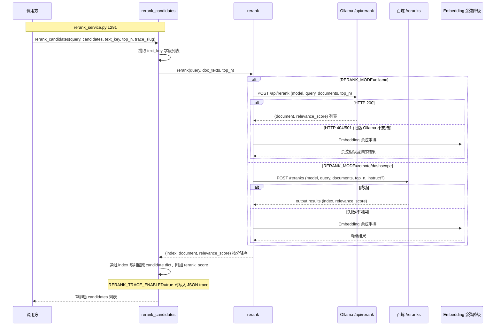
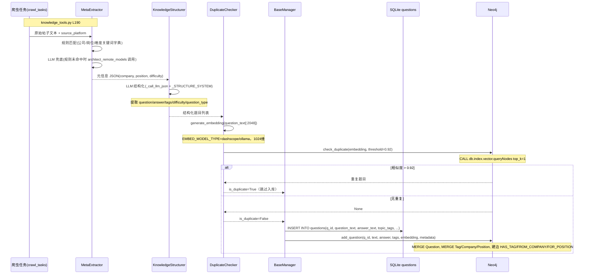
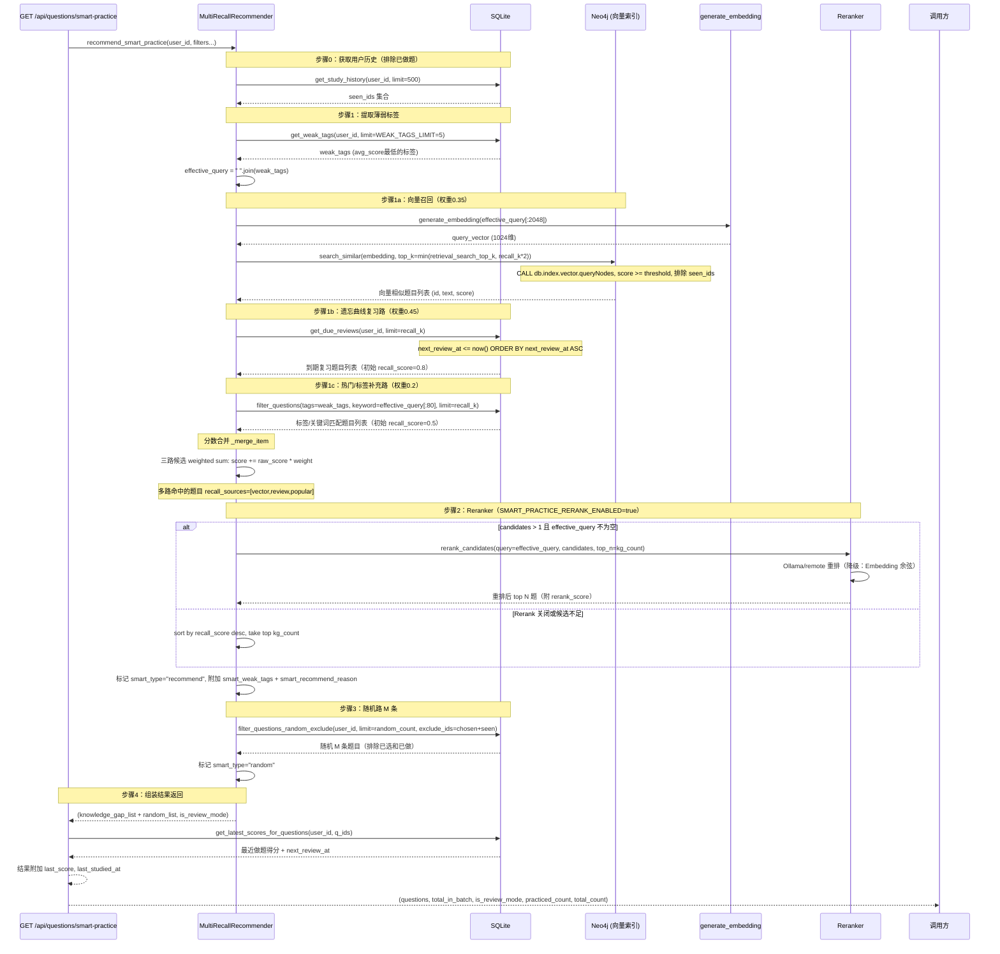
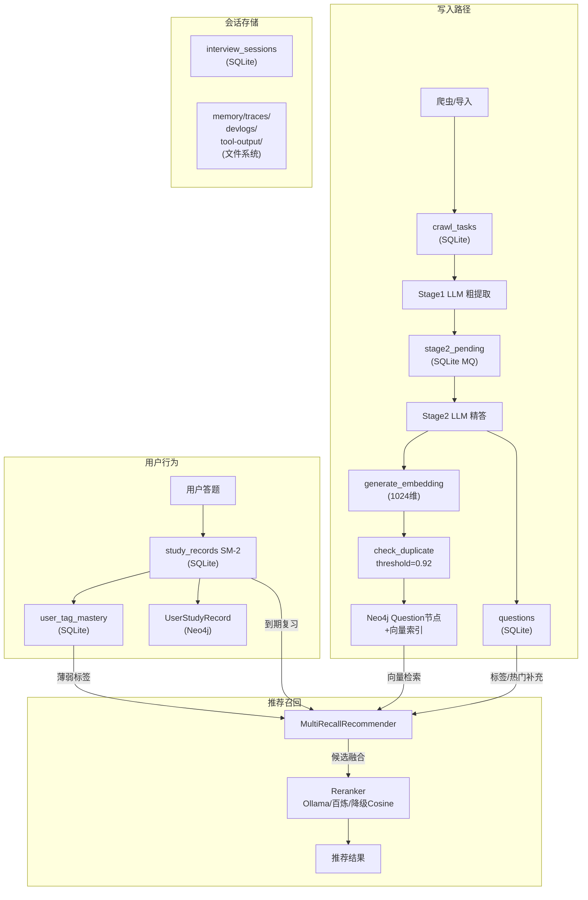

# 面经 Agent 系统架构深度解析

> 阅读说明：所有源码链接在 Cursor Preview 模式下可点击跳转到对应文件和行号。

## 目录

1. [存储介质全览](#存储介质全览)
2. [Rerank 详细配置](#rerank-详细配置)
3. [知识图谱构建算法](#知识图谱构建算法)
4. [题目推荐完整链路](#题目推荐完整链路)

---

## 存储介质全览

系统采用「三层异构存储」架构：结构化关系型（SQLite）+ 图向量（Neo4j）+ 文件系统（JSON/JSONL/Log）。

### 核心文件索引


| 文件                                                                                    | 关键行         | 职责                               |
| ------------------------------------------------------------------------------------- | ----------- | -------------------------------- |
| [sqlite_service.py · L22](./backend/services/storage/sqlite_service.py#L22)           | L22-L277    | SQLite 所有表 DDL                   |
| [neo4j_service.py · L15](./backend/services/storage/neo4j_service.py#L15)             | L15-L84     | Neo4j 节点/关系/向量索引定义               |
| [sqlite_session_store.py · L1](./backend/services/storage/sqlite_session_store.py#L1) | L1-L60      | 会话持久化（hello_agents SessionStore） |
| [config.py · L1311](./backend/config/config.py#L1311)                                 | L1311-L1410 | 所有存储路径配置                         |
| [main.py · L60](./backend/main.py#L60)                                                | L60-L93     | 目录初始化                            |


---

### 1. SQLite — 主业务数据库

**路径**：`backend/data/local_data.db`（由 `SQLITE_DB_PATH` 覆盖）

WAL 模式（`PRAGMA journal_mode=WAL`），允许读写并发，提取任务与提交作答互不阻塞。

对应四层记忆体系：

```
Working Memory   → interview_sessions.conversation_history（当前对话上下文）
Episodic Memory  → study_records + interview_sessions（做题历史、会话记录）
Semantic Memory  → user_profiles + user_tag_mastery（用户画像、标签掌握度）
题库              → questions（结构化题目元数据）
```

**完整表清单（14 张）**：


| 表名                    | 职责                   | 关键字段                                                                                                 |
| --------------------- | -------------------- | ---------------------------------------------------------------------------------------------------- |
| `questions`           | 题目元数据（与 Neo4j 双写）    | q_id, question_text, answer_text, topic_tags(JSON), difficulty, company, source_platform, raw_answer |
| `user_profiles`       | 用户画像（语义记忆层）          | user_id, resume_text, tech_stack(JSON), target_company                                               |
| `user_tag_mastery`    | 标签掌握度（推荐引擎核心）        | user_id, tag, avg_score, mastery_level, total_attempts                                               |
| `study_records`       | 做题记录 + SM-2 遗忘曲线参数   | user_id, question_id, score, easiness_factor, repetitions, interval_days, next_review_at             |
| `interview_sessions`  | 面试会话（含对话历史）          | session_id, user_id, conversation_history(JSON), session_meta                                        |
| `user_notes`          | 用户笔记（Note 工具）        | note_id, user_id, question_id, tags(JSON)                                                            |
| `crawl_logs`          | 爬取历史日志               | url, status, questions_extracted                                                                     |
| `episodic_log`        | 情节记忆日志（可扩展向量检索）      | user_id, content, event_type, importance                                                             |
| `ingestion_logs`      | 题目入库日志               | question_id, source_url, tags                                                                        |
| `knowledge_resources` | 知识资源（章节推荐）           | resource_id, url, tags, resource_type                                                                |
| `finetune_samples`    | 微调样本（两阶段 Miner）      | content, stage1_output, stage2_output, stage1_model, stage2_model                                    |
| `finetune_runs`       | 微调训练记录               | config_json, output_dir, status                                                                      |
| `crawl_tasks`         | 爬虫任务队列（去重+状态追踪）      | task_id, source_url, status(pending/fetched/done/error), raw_content, image_paths                    |
| `stage2_pending`      | Stage2 异步 MQ（替代消息队列） | task_id, stage1_output, rough_questions, status, worker_id, locked_at                                |


相关源码：

[sqlite_service.py · L40](./backend/services/storage/sqlite_service.py#L40)

```python
def _init_tables(self):
    # questions：题目元数据补充表（与 Neo4j 双写，支持结构化过滤）
    # study_records：SM-2 遗忘曲线字段（情景记忆层）
    # crawl_tasks：爬虫任务队列（含 WAL 并发模式）
    # stage2_pending：两阶段异步 MQ，达到 batch_size 触发
    ...
```

---

### 2. Neo4j — 知识图谱 + 向量检索

**连接**：由 `NEO4J_URI` / `NEO4J_USERNAME` / `NEO4J_PASSWORD` / `NEO4J_DATABASE` 配置。

**降级策略**：连接失败时 `available=False`，系统继续启动，SQLite 功能正常，向量检索/图关系不可用。

**节点类型（6 类）**：


| 节点标签              | 唯一性约束字段                  | 职责                  |
| ----------------- | ------------------------ | ------------------- |
| `Question`        | `id`                     | 题目节点，含 embedding 向量 |
| `Tag`             | `name`                   | 技术标签节点              |
| `Company`         | `name`                   | 公司节点                |
| `Position`        | `name`                   | 岗位节点                |
| `Concept`         | `name`                   | 知识点概念（GraphRAG）     |
| `UserStudyRecord` | `(user_id, question_id)` | 用户学习记录（遗忘曲线+时间复习）   |


**关系类型（6 类）**：


| 关系               | 方向                  | 语义               |
| ---------------- | ------------------- | ---------------- |
| `HAS_TAG`        | Question → Tag      | 题目属于某技术标签        |
| `FROM_COMPANY`   | Question → Company  | 题目来自某公司          |
| `FOR_POSITION`   | Question → Position | 题目面向某岗位          |
| `COVERS_CONCEPT` | Question → Concept  | 题目覆盖某知识点         |
| `RELATED_TO`     | Concept ↔ Concept   | 知识点间关联（GraphRAG） |
| `VARIANT_OF`     | Question ↔ Question | 换个问法的变体题目        |


**向量索引**：

[neo4j_service.py · L57](./backend/services/storage/neo4j_service.py#L57)

```python
# 向量索引（1024 维，DashScope text-embedding-v3/v4 / Ollama qwen3-embedding:0.6b）
CREATE VECTOR INDEX question_embeddings IF NOT EXISTS
FOR (n:Question) ON (n.embedding)
OPTIONS {indexConfig: {
  `vector.dimensions`: 1024,
  `vector.similarity_function`: 'cosine'
}}
```

---

### 3. 文件系统 — Agent 记忆与日志

所有路径以 `backend/data/` 为根（`BACKEND_DATA_DIR` 覆盖）：


| 目录/文件         | 路径（默认）                                            | 职责                       |
| ------------- | ------------------------------------------------- | ------------------------ |
| **SQLite DB** | `backend/data/local_data.db`                      | 主数据库                     |
| **内存根目录**     | `backend/data/memory/`                            | HelloAgents 会话持久化根目录     |
| Agent Trace   | `backend/data/memory/traces/`                     | Agent 推理 trace 文件        |
| DevLog        | `backend/data/memory/devlogs/`                    | Agent DevLog 落盘          |
| Tool Output   | `backend/data/memory/tool-output/`                | 工具调用输出落盘                 |
| **日志根目录**     | `backend/logs/`                                   | 所有日志                     |
| 后端滚动日志        | `backend/logs/backend.log`                        | 10MB 滚动，保留 5 个           |
| Rerank 追踪     | `backend/logs/similar_rerank/`                    | 每次 Rerank 前后候选 JSON      |
| 子进程日志         | `backend/logs/subprocess/`                        | 批量提取/Stage2 子进程日志        |
| Agent 日志      | `backend/logs/agents/`                            | 每个 Agent 单独文件            |
| 批量提取进度        | `backend/logs/batch_extract_state.json`           | shutdown 时持久化，重启恢复       |
| 批量提取中断        | `backend/logs/batch_extract.abort`                | 优雅终止信号文件                 |
| **工具调用日志**    | `backend/interviewer_logs/tools_*.jsonl`          | 工具调用时序日志（前端 thinking 兜底） |
| **帖子图片**      | `backend/data/post_images/{task_id}/`             | 爬虫图片，静态服务 `/post-images` |
| **XHS 数据**    | `backend/data/xhs_user_data/`                     | 小红书用户数据                  |
| **牛客输出**      | `backend/data/nowcoder_output/`                   | 牛客爬虫原始输出                 |
| 迁移标记          | `backend/data/memory/chat_history_migration.done` | 历史会话一次性迁移标记              |


---

## Rerank 详细配置

Rerank 服务文件：[rerank_service.py · L1](./backend/services/rerank_service.py#L1)

### 核心参数（全部来自 .env）


| 环境变量                        | 默认值                                                | 说明                                                     |
| --------------------------- | -------------------------------------------------- | ------------------------------------------------------ |
| `RERANK_ENABLED`            | `true`                                             | 全局 Rerank 开关                                           |
| `RERANK_MODE`               | `ollama`                                           | 后端模式：`ollama`（本地）/ `remote`/`dashscope`/`bailian`（阿里云） |
| `RERANK_MODEL`              | `dengcao/Qwen3-Reranker-8B:Q4_K_M`                 | Ollama 模型；remote 模式下改为 `qwen3-rerank`                  |
| `RERANK_OLLAMA_URL`         | `http://localhost:11434`                           | Ollama 服务地址（ollama 模式）                                 |
| `RERANK_API_KEY`            | （复用 `EMBED_API_KEY`）                               | 百炼 API 密钥（remote 模式）                                   |
| `RERANK_REMOTE_BASE_URL`    | `https://dashscope.aliyuncs.com/compatible-api/v1` | 百炼 API 根 URL                                           |
| `RERANK_INSTRUCT`           | `""`                                               | qwen3-rerank 任务说明（英文），空则使用服务端默认                        |
| `RERANK_TOP_N`              | `5`                                                | 默认返回 top N 条                                           |
| `RERANK_MAX_DOC_LENGTH`     | `1024`                                             | 文档最大字符数（截断避免超时）                                        |
| `RERANK_TIMEOUT`            | `60`                                               | 超时秒数                                                   |
| `RERANK_TRACE_ENABLED`      | `true`                                             | 是否将候选列表和重排结果写入文件                                       |
| `RERANK_TRACE_DIR`          | `backend/logs/similar_rerank`                      | 追踪 JSON 目录                                             |
| `RERANK_TRACE_TEXT_MAX_LEN` | `4000`                                             | 追踪文本最大长度                                               |


**智能练习专用 Rerank 开关**：


| 环境变量                            | 默认值    | 说明                         |
| ------------------------------- | ------ | -------------------------- |
| `SMART_PRACTICE_RERANK_ENABLED` | `true` | 智能练习 Rerank 子开关（独立于全局）     |
| `WARMUP_EMBEDDING_RERANK_OCR`   | `true` | 启动时是否预热 Embedding+Reranker |


### Rerank 调用流程




### Embedding 余弦降级策略

[rerank_service.py · L164](./backend/services/rerank_service.py#L164)

```python
def _rerank_via_embedding_cosine(query, doc_texts, top_n, timeout):
    # 1. 将 query + 全部 doc 拼成批次，调用 /api/embed（单次请求）
    # 2. 取第 0 个向量作为 query_vec，其余为 doc_vecs
    # 3. 计算余弦相似度矩阵：mat @ q / (qn * dn)
    # 4. 按 score 降序取 top_n
```

---

## 知识图谱构建算法

### 整体流程




### 节点入库 Cypher（核心）

[neo4j_service.py · L233](./backend/services/storage/neo4j_service.py#L233)

```cypher
MERGE (q:Question {id: $q_id})
SET q.text            = $text,
    q.answer          = $answer,
    q.embedding       = $embedding,   -- 1024维向量
    q.difficulty      = $difficulty,
    q.question_type   = $question_type,
    q.source_platform = $source_platform,
    q.source          = $source,
    q.company         = $company,
    q.position        = $position,
    q.created_at      = datetime()

WITH q
UNWIND $tags AS tag_name
MERGE (t:Tag {name: tag_name})
MERGE (q)-[:HAS_TAG]->(t)

WITH q WHERE $company <> ''
MERGE (c:Company {name: $company})
MERGE (q)-[:FROM_COMPANY]->(c)

WITH q WHERE $position <> ''
MERGE (p:Position {name: $position})
MERGE (q)-[:FOR_POSITION]->(p)
```

### 元信息提取策略（两阶段）

[knowledge_tools.py · L190](./backend/services/knowledge/knowledge_tools.py#L190)

**阶段一：规则字典匹配（零延迟）**


| 维度  | 规则关键词示例                                                 |
| --- | ------------------------------------------------------- |
| 公司  | 字节→["字节","bytedance","tiktok"]；阿里→["阿里","alibaba","淘宝"] |
| 岗位  | 后端→["后端","server","java","go"]；算法→["算法","ml","深度学习"]    |
| 难度  | hard→["拷打","深挖","疯狂","压力"]；easy→["简单","基础","顺利"]        |


**阶段二：LLM 兜底（规则未命中时）**

调用 `architect_remote_models` 端点列表（支持多端点故障转移），要求返回 `json_object` 格式，提取 `company/position/business_line`。

### 查重算法

[neo4j_service.py · L424](./backend/services/storage/neo4j_service.py#L424)

```python
def check_duplicate(self, embedding, threshold=0.92):
    # 余弦相似度查重，threshold=0.92（硬编码）
    # 调用 search_similar(top_k=1)，若分数 >= 0.92 则认为重复
    results = self.search_similar(embedding, top_k=1, score_threshold=threshold)
    return results[0] if results else None
```

向量检索 Cypher：

```cypher
CALL db.index.vector.queryNodes('question_embeddings', $top_k, $embedding)
YIELD node, score
WHERE score >= $threshold AND NOT node.id IN $exclude_ids
RETURN node.id AS id, node.text AS text, node.answer AS answer,
       node.difficulty AS difficulty, node.company AS company, score
ORDER BY score DESC
```

### GraphRAG 扩展：Concept 知识图谱

[neo4j_service.py · L578](./backend/services/storage/neo4j_service.py#L578)

`get_related_concepts` 采用双策略：

```
策略1（优先）：RELATED_TO 直接关系
MATCH (c:Concept {name: $concept_name})-[:RELATED_TO]-(other:Concept)

策略2（兜底）：共现（同题目覆盖的其他 Concept）
MATCH (c:Concept)<-[:COVERS_CONCEPT]-(q:Question)-[:COVERS_CONCEPT]->(other:Concept)
WHERE other.name <> $concept_name
ORDER BY rand()
```

---

## 题目推荐完整链路

**API 入口**：`GET /api/questions/smart-practice`

**核心类**：[multi_recall_recommender.py · L170](./backend/services/multi_recall_recommender.py#L170)

### 配置参数一览


| 环境变量                                 | 默认值  | 说明                      |
| ------------------------------------ | ---- | ----------------------- |
| `SMART_PRACTICE_KNOWLEDGE_GAP_COUNT` | 10   | 知识点不足路最终取 N 条           |
| `SMART_PRACTICE_RANDOM_COUNT`        | 10   | 随机路取 M 条                |
| `SMART_PRACTICE_RECALL_RATIO`        | 3.0  | 召回倍数（先召回 N×3 条再 Rerank） |
| `SMART_PRACTICE_RERANK_ENABLED`      | true | 是否对知识点不足路做 Rerank       |
| `SMART_PRACTICE_VECTOR_WEIGHT`       | 0.35 | 向量召回权重                  |
| `SMART_PRACTICE_REVIEW_WEIGHT`       | 0.45 | 遗忘曲线到期复习权重              |
| `SMART_PRACTICE_POPULAR_WEIGHT`      | 0.2  | 热门/标签补充权重               |
| `SMART_PRACTICE_WEAK_TAGS_LIMIT`     | 5    | 薄弱标签最多取前 N 个            |
| `retrieval_search_top_k`             | —    | 向量召回每次最大返回数             |
| `retrieval_score_threshold`          | —    | 向量召回分数门槛                |


### 推荐链路时序图




### 分数合并算法

[multi_recall_recommender.py · L335](./backend/services/multi_recall_recommender.py#L335)

```python
def _merge_item(merged, item, source, weight):
    # 已存在：累加加权分数，追加 recall_sources
    # 首次：写入，分数 = raw_score * weight
    score = item.get("recall_score", 0) * weight
    if q_id in merged:
        merged[q_id]["recall_score"] += score
        if source not in merged[q_id]["recall_sources"]:
            merged[q_id]["recall_sources"].append(source)
    else:
        item["recall_score"] = score
        merged[q_id] = item
```

三路初始分数：

- 向量召回：Neo4j cosine 相似度（0~1）× 0.35
- 遗忘曲线：固定 0.8 × 0.45 = 0.36
- 热门补充：固定 0.5 × 0.2 = 0.10

同时被向量+复习命中的题目，融合分 ≈ 0.36 + 向量贡献，最优先推荐。

### SM-2 遗忘曲线算法

[sqlite_service.py · L833](./backend/services/storage/sqlite_service.py#L833)

```python
@staticmethod
def compute_sm2(score, easiness_factor, repetitions, interval_days):
    if score < 3:           # 0-2分：重置（未掌握）
        repetitions = 0
        interval_days = 1
    else:                   # 3-5分：掌握
        if repetitions == 0:   interval_days = 1
        elif repetitions == 1: interval_days = 6
        else:                  interval_days = max(1, round(interval_days * easiness_factor))
        repetitions += 1

    # EF 更新公式（EF 最低 1.3）
    easiness_factor = max(1.3, ef + 0.1 - (5 - score) * (0.08 + (5 - score) * 0.02))
    next_review_at = now_beijing() + timedelta(days=interval_days)
    return easiness_factor, repetitions, interval_days, next_review_at
```

复习间隔由 EF（Easiness Factor，初始 2.5）动态调整；满分 5 分时 EF 增大（间隔拉长），低分时 EF 减小（高频复习）。

### 推荐理由生成

[multi_recall_recommender.py · L364](./backend/services/multi_recall_recommender.py#L364)

根据 `recall_sources` 组合自动生成中文推荐理由：


| recall_sources     | smart_type | 推荐理由示例                       |
| ------------------ | ---------- | ---------------------------- |
| `[vector]`         | recommend  | "结合你的薄弱标签「Redis、JVM」做的相似题召回" |
| `[review]`         | recommend  | "遗忘曲线到期，适合巩固复习"              |
| `[vector, review]` | recommend  | 两条拼接                         |
| `[popular]`        | recommend  | "在当前筛选条件下的标签/热门补充"           |
| —                  | random     | "随机拓展练习，均衡覆盖面"               |


---

## 整体存储架构总览




