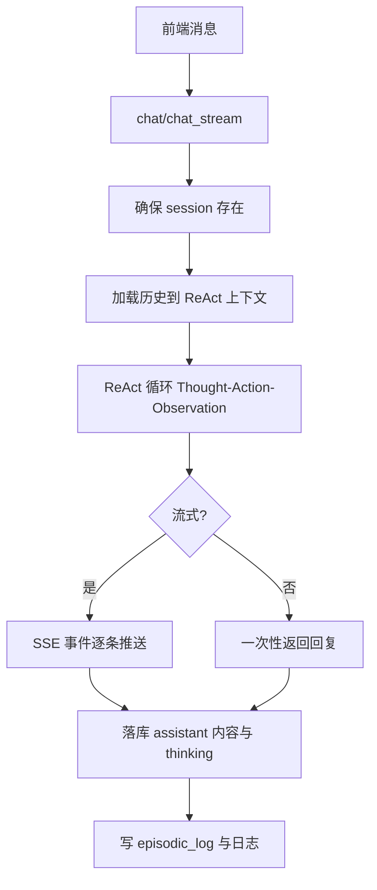
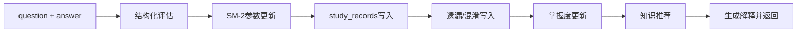

# InterviewerAgent 全景文档

对应代码：`backend/agents/interviewer_agent.py`。

## 1. Agent 定位

InterviewerAgent 是“面试训练主 Agent”，特点是 **ReAct 对话 + 业务编排合体**：

- 判断型任务（问答、解释、推荐）走 ReAct 循环。
- 确定型任务（提交答案、收录、结束会话）走代码编排。
- 同时承担会话管理、工具调用统计、流式事件转发、记忆写入。

## 2. 核心职责分层

- 对话层：`chat()`、`chat_stream()`、`arun_stream()`。
- 评估层：`submit_answer()` + `_evaluate_answer_structured()`。
- 记忆层：`_write_working/_write_episodic/_write_semantic`。
- 收录层：`ingest_instant()/ingest_batch()` + `_run_ingestion_pipeline()`。
- 会话层：SQLite 会话同步、历史加载、消息 patch、结束收口。

## 3. 工具体系

- 通过 `get_interviewer_tools()` 动态注册业务工具。
- 内置 ReAct 工具：`Thought`、`Finish`。
- 重写 `_execute_tools_async_stream()`，将 `args` 强制回传，解决前端流式工具参数可见性问题。
- 工具调用统一写入 `agent_tool_runtime_stats`（成功率、耗时、用户维度）。

### 3.1 工具总览（已实现）

Interviewer 当前注册 11 个业务工具（`get_interviewer_tools()`）：

- `get_session_context`
- `get_recommended_question`
- `find_similar_questions`
- `filter_questions`
- `get_question_detail`
- `submit_answer`
- `record_weakness`
- `manage_note`
- `get_mastery_report`
- `get_knowledge_recommendation`
- `analyze_resume`

### 3.2 每个工具的功能/参数/返回值

#### A. `get_recommended_question`
- **功能**：按用户意图推荐题（薄弱点/复习/随机混合）。
- **参数**：
  - `topic: string`（可选）
  - `company: string`（可选）
  - `difficulty: string`（可选，`easy|medium|hard`）
- **返回**：`ToolResponse.success(text=<JSON字符串>)`
  - 结构：`{总数, 筛选条件, 题目列表[]}`，题目含 `题目ID/题目/难度/标签/公司/推荐理由`

#### B. `find_similar_questions`
- **功能**：按语义找相似题，支持排除当前题。
- **参数**：
  - `question_text: string`（必填）
  - `exclude_id: string`（可选）
  - `company: string`（可选）
  - `difficulty: string`（可选）
  - `limit: integer`（可选）
- **返回**：`ToolResponse.success(text=<JSON数组>)`
  - 每项含 `q_id/question_text/difficulty/topic_tags/company/similarity_score`
  - 无结果时 `ToolResponse.error(code="INVALID_PARAM", ...)`

#### C. `filter_questions`
- **功能**：题库筛选列表。
- **参数**：
  - `company: string`（可选）
  - `tags: array|string`（可选）
  - `difficulty: string`（可选）
  - `question_type: string`（可选）
  - `keyword: string`（可选）
  - `date_from/date_to: string`（可选）
  - `limit: integer`（可选）
- **返回**：`{total, returned, questions[]}`

#### D. `get_question_detail`
- **功能**：按 `q_id` 获取题目详情和标准答案。
- **参数**：
  - `question_id: string`（必填）
- **返回**：`{question_id, question_text, answer_text, topic_tags, difficulty}`

#### E. `submit_answer`
- **功能**：记录评分结果（不做评估推理），落库 + SM-2 + 会话写入。
- **参数**：
  - `question_id: string`（必填）
  - `user_answer: string`（可选，不传则取当前用户消息）
  - `score: number`（必填，0-5，支持 0.5）
  - `feedback: string`（必填）
  - `record_weakness_notes: string|bool`（可选）
  - `strong_points: array`（可选）
  - `missed_points: array`（可选）
  - `error_points: array`（可选）
- **返回**：`{score, feedback, strong_points, missed_points, error_points, tags, standard_answer, sm2, message_id, message}`

#### F. `record_weakness`
- **功能**：把遗漏点/混淆点写入 `episodic_log + user_notes`。
- **参数**：
  - `confusion_points: array`（可选）
  - `missed_points: array`（可选）
  - `tags: array`（可选）
- **返回**：`{success, reason, message, count}`

#### G. `manage_note`
- **功能**：笔记 CRUD。
- **参数**：
  - `action: string`（必填：`create|list|update|delete`）
  - `content/title/tags/question_id/note_id/keyword`（按动作可选/必需）
- **返回**：
  - create：`{note_id, message}`
  - list：`{count, notes}`
  - update/delete：`{success, message}`

#### H. `get_session_context`
- **功能**：当前会话练习统计。
- **参数**：无
- **返回**：`{total_questions, avg_score, tags_practiced, message}`

#### I. `get_mastery_report`
- **功能**：掌握度报告 + 薄弱点 + 复习建议。
- **参数**：
  - `date_from/date_to: string`（可选，支持“今天/近N天/日期”）
- **返回**：`{total_questions_practiced, overall_avg_score, correct_rate_pct, mastery_by_level, weak_tags, weak_questions, weakness_notes, review_questions, advice}`

#### J. `get_knowledge_recommendation`
- **功能**：延伸知识点、延伸题、学习资源推荐。
- **参数**：
  - `topic: string`（可选）
  - `question_id: string`（可选）
  - `limit_concepts: integer`（可选）
  - `limit_questions: integer`（可选）
- **返回**：`{related_concepts, extension_questions, resources, recent_mistakes}`

#### K. `analyze_resume`
- **功能**：更新用户画像（非出题工具）。
- **参数**：
  - `resume_text: string`（必填）
  - `tech_stack: array`（必填）
  - `target_position: string`（必填）
  - `experience_level: string`（必填）
  - `target_company/preferred_topics`（可选）
- **返回**：`{message, tech_stack, target_position, target_company, experience_level, preferred_topics}`

## 4. 对话链路（同步/流式）

## 5. 提交答案链路（最核心）

`submit_answer()` 是 InterviewerAgent 的业务中枢：

1) 拉取标准答案（题库）  
2) 结构化评分（LLM JSON）  
3) 写 `study_records` + SM-2 更新  
4) 记录遗漏/混淆（`episodic_log` + `user_notes`）  
5) 更新 `user_tag_mastery`  
6) 连续薄弱检测与知识推荐  
7) 生成自然语言解释返回前端

## 6. 流式事件增强点

- 将底层 `LLM_CHUNK`、`TOOL_CALL_FINISH`、`AGENT_FINISH` 做二次封装。
- 在 `AGENT_FINISH` 中附加完整 `thinking_steps`。
- 在 `STEP_FINISH` 时从 adapter 侧抓取 `reasoning_content`，补 THINKING 事件。

## 7. 会话与持久化策略

- 主会话持久化在 SQLite：`interview_sessions.conversation_history`。
- `chat_stream` 先写“生成中占位”，结束后 `patch_last_assistant_content` 回填完整结果。
- 对并发写入做保护：防止短内容覆盖完整内容。

## 8. 记忆机制在 Interviewer 中的使用

- 工作记忆：当前轮用户输入/模型输出（轻量日志）。
- 情景记忆：答题事件、对话摘要、收录事件。
- 语义记忆：连续薄弱标签、优势标签、用户画像变化。
- 感知记忆：当前场景基本不启用（方法保留）。

## 9. 稳定性与降级

- 评估 JSON 解析失败时保存失败样本，避免静默错误。
- 模型超时返回友好提示，不阻塞进程。
- 流式异常统一映射为前端可理解错误文案。

## 10. 可观测性

- trace：hello_agents trace + reasoning trace。
- tool stats：按工具维度记录成功率/耗时。
- interviewer logs：聊天、思考过程、输入输出长度等。

## 11. 关键输入输出

- 输入：`user_id/session_id/message/resume`。
- 输出：
  - 对话接口：文本 + thinking steps（流式或非流式）。
  - 答题接口：`score/feedback/shortcomings/error_points/missed_points/strong_points/recommendation/explanation`。

## 12. 与系统其他模块关系

- 与 `sqlite_service`：数据主存储。
- 与 `knowledge_manager`：收录后结构化入库。
- 与 `reasoning_trace_service`：推理追踪展示。
- 与前端 `ChatView/ReportView/ToolUsageView`：核心消费方。
