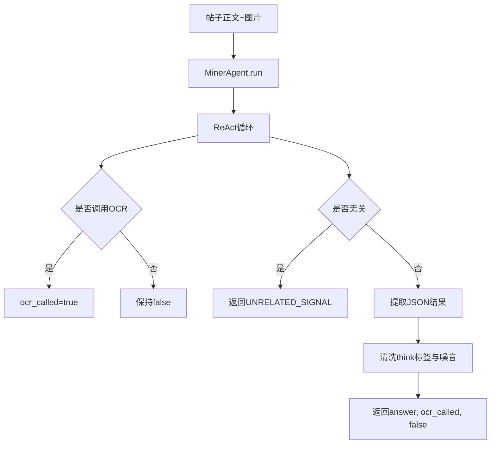

# MinerAgent 全景文档

## 0. 代码入口（当前架构）

采集链路中的「题目提取」由多层模块协作，阅读时可按调用链自下而上对照：

| 层级 | 典型模块 | 说明 |
|------|----------|------|
| 任务执行 | `backend/services/crawler/task_executor.py` | 按钮/定时任务统一入口 `execute()` |
| 单任务处理 | `backend/services/crawler/question_extractor.py` | 单帖 OCR、调用 Miner、入库、Stage2 入队等 |
| ReAct / 两阶段 | `backend/agents/miner_react_agent.py`、`two_stage_miner_agent.py` | ReAct 循环与 Stage1/Stage2 编排 |
| Agent 基类 | `backend/agents/miner_agent.py`（及 `miner_agent_v3.py` 等变体） | 工具注册与 ReAct 步进 |

下文以 **`backend/agents/miner_agent.py`** 中的 MinerAgent 为核心描述工具与行为；若你使用 `MINER_MODE=two_stage`，Stage2 富化在 `backend/services/stage2_processor.py` 与队列表 `stage2_pending` 上运行，详见进程与配置文档。

## 1. Agent 定位

MinerAgent 是“内容抽取专用 Agent”，目标是从帖子正文中提取结构化面试题数据，服务于采集链路。

## 2. 核心职责

- 输入：帖子正文、是否有图、公司岗位上下文。
- 过程：ReAct 循环调用 OCR 与“无关标记”工具。
- 输出：
  - 有效 JSON（题目数组）
  - `UNRELATED_SIGNAL`（无关帖子）
  - 空字符串（失败）
- 并携带 `ocr_called`、`is_unrelated` 两个关键状态位。

## 3. 配置与约束

- 模型配置来自 `settings.miner_*`。
- `max_steps` 受 `settings.miner_max_steps` 限制。
- 禁用 TodoWrite/DevLog，避免模型把步数浪费在任务规划。
- 启用 trace/circuit/tool 截断以保障可观测性与稳定性。

## 4. 工具设计

- `ocr_images`：从采集图片中做 OCR，补正文缺失。
- `mark_unrelated`：明确标记“非面经/无效帖子”。
- ReAct 内置：`Thought`、`Finish`。

### 4.1 Miner 工具参数与返回值（已实现）

#### A. `ocr_images`（`OcrImagesTool`）
- **功能**：对帖子图片做 OCR 文本识别。
- **参数**：无（图片路径由 Agent 初始化注入）。
- **返回**：
  - 成功：`ToolResponse.success(text=<ocr文本>, data={image_count, char_count, ocr_called:true})`
  - 无图片：`ToolResponse.success(text="", data={image_count:0, ocr_called:true})`
  - 失败：`ToolResponse.error(code="OCR_FAILED", message=...)`

#### B. `mark_unrelated`（`MarkUnrelatedTool`）
- **功能**：标记帖子无关并终止提取。
- **参数**：
  - `reason: string`（可选）
- **返回**：
  - `ToolResponse.success(text="__UNRELATED__", data={reason})`

#### C. `verify_extraction_count`（`VerifyExtractionCountTool`，当前 MinerAgent 未注册）
- **功能**：校验提取题数与预期题数是否一致。
- **参数**：
  - `extracted_count: integer`（必填）
  - `expected_count: integer`（必填）
- **返回**：
  - 一致：`ToolResponse.success(..., data={verified:true})`
  - 不一致：`ToolResponse.error(code="COUNT_MISMATCH", message=...)`

#### D. `Finish`（`FinishTool`，当前由 ReAct 内置）
- **功能**：提交最终提取结果并结束任务。
- **参数**：
  - `answer: string`（必填，JSON 数组字符串）
- **返回**：
  - `ToolResponse.success(text=<answer>, data={answer})`

## 5. 执行路径（3 种结束）

1) 正常：调用 `Finish`，返回 JSON。  
2) 无关：调用 `mark_unrelated` 或输出 unrelated 对象。  
3) 异常/超步：返回空串，交由上层重试或记错。

## 6. 结果清洗与纠偏

- `_strip_think_tags()`：去掉 `<think>`、`\boxed{}`、无关说明文字。
- `_extract_json_if_direct_reply()`：当模型未调用 Finish、直接输出文本时，尝试提取 JSON 数组。
- `_is_unrelated_object()`：从自然语言中兜底识别 `{status:"unrelated"}`。

## 7. 采集链路中的角色

- `crawl_tasks` 正文抓取后触发 Miner。
- Miner 输出进入：
  - 题库入库流程（`questions`）
  - 或 `stage2_pending` 队列（两阶段补充）
  - 或 `error/unrelated` 状态。

## 8. 与上层模块协作

- 与 `task_executor/stage2_processor` 协作，形成批处理链路。
- 与 `agent_tool_runtime_stats` 协作记录工具耗时。
- 与 trace 系统协作，支持前端“提取过程回放”。

## 9. 质量保障点

- 强约束输出结构，降低脏数据入库概率。
- 对“无关帖子”有显式信号，避免污染题库。
- 对模型未按协议输出的情况做 JSON 提取兜底。

## 10. 可优化方向

- 在 `mark_unrelated` 判定上增加置信度，减少误伤。
- OCR 结果可加质量评分（文本长度、关键词命中）参与决策。
- 将失败样本自动投递到微调样本池，反哺 Miner 提示词与模型。
