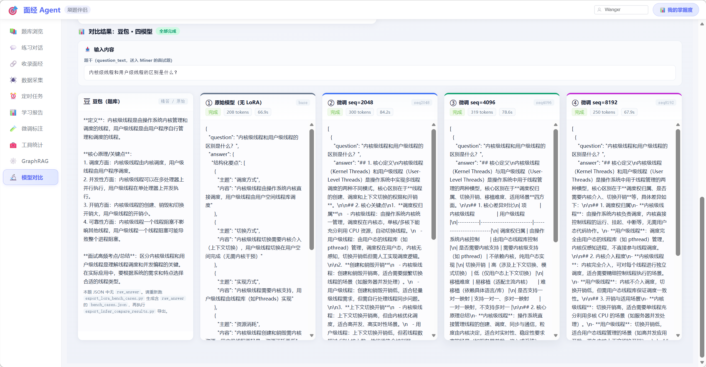

# 模型对比页面说明（`ModelCompareView`）

> 前端：`web/src/views/ModelCompareView.vue`  
> 侧边栏：**「模型对比」**（`App.vue` → `currentView === 'model_compare'`）  
> 全站视图与目录索引：[`docs/README.md`](../README.md)

## 1. 功能目的

在 **同一面经原文** 上，使用与「微调标注 · AI 辅助」**相同的 system prompt**（`_ASSIST_SYSTEM_PROMPT`），通过 OpenAI 兼容接口 **并行** 调用多个端点，并排展示：

- 结构化 **JSON**（可折叠树，失败时展示原始文本）；
- **解析题数**（输出为合法 JSON 数组时）；
- **耗时**、**模型名**；
- 顶部 **题量速览** 条（按列 A/B/C 对应三槽位）。

用于直观对比：**本地基座**、**本地微调后（Ollama 另一模型名）**、**Miner 远程**、**标注辅助模型**、**全局远程对话模型** 等在抽取任务上的表现差异。

## 2. 依赖的后端接口

| 方法 | 路径 | 说明 |
|------|------|------|
| GET | `/api/finetune/compare-presets` | 返回可选预设列表（`id`、`label`、`description`、`model`、`base_url` 摘要、`configured`） |
| POST | `/api/finetune/compare` | Body：`preset_ids`（2～4 个字符串）、`content`、`title`（可选）；返回 `results[]` |
| GET | `/api/finetune/samples` | 下拉「载入样本」（常用 `status=labeled&order=desc`） |
| GET | `/api/finetune/samples/{id}` | 载入单条完整正文与标题 |

实现位置：`backend/services/finetune/finetune_service.py`（`list_model_compare_presets`、`compare_models_parallel`、`openai_miner_style_extract`）。

## 3. 预设与环境变量对应

| 预设 `id` | 展示名称 | 主要环境变量 / 说明 |
|-----------|----------|---------------------|
| `miner_local` | Miner · 本地 | `MINER_LOCAL_MODEL`、`MINER_LOCAL_BASE_URL`、`MINER_LOCAL_API_KEY`（可空，Ollama 常用占位 key） |
| `finetuned_local` | 本地 · 微调后 | **`COMPARE_FINETUNED_OLLAMA_MODEL`** + 与 Miner 本地相同的 `MINER_LOCAL_BASE_URL` |
| `miner_remote` | Miner · 远程 | `MINER_REMOTE_*` |
| `finetune_assist` | 标注辅助模型 | `FINETUNE_*`（或 `FINETUNE_MODE` 切换 local/remote） |
| `app_remote` | 全局远程（练习对话） | `LLM_REMOTE_*` |

未配置完整的预设在前端下拉中显示为 **未配置** 且不可选。

## 4. 使用注意

1. **至少两列选择不同预设**，否则会前端提示且不发请求。  
2. 载入样本后若修改正文，以输入框为准（请求 **不** 附带 `sample_id`，避免覆盖用户编辑）。  
3. 训练相关依赖（Unsloth、GPU 等）见 [`微调模块技术解析.md`](../微调模块技术解析.md) 与 [`环境配置说明.md`](../环境配置说明.md)。  
4. HTTP 非 2xx 时前端会解析 FastAPI `detail` 并弹错误提示。

## 5. 效果图

**路径（仓库内）**：`docs/项目图片/19_模型对比结果.png`

## 6. 相关文档

- [`页面功能与按钮说明.md`](页面功能与按钮说明.md) — 全页索引与占位图列表  
- [`API全量文档.md`](API全量文档.md) — 微调接口表含 `compare-*`  
- [`微调模块技术解析.md`](../微调模块技术解析.md) — 训练与推理侧理论  
