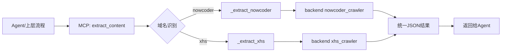

# 自己封装的 MCP 详细说明文档

> 本文专门讲你自己封装并在本项目实际使用的 MCP。  
> 当前业务主 MCP 为：`mcp-content-extractor`。

---

## 目录

- 1. 文档范围
- 2. MCP 定位与目标
- 3. 目录结构（你封装的 MCP）
- 4. 核心能力与工具清单
- 5. 每个工具的详细说明（入参/出参/行为）
- 6. 架构与调用链路
- 7. 与主项目的依赖关系
- 8. 运行方式与部署方式
- 9. 配置项与环境变量
- 10. 错误处理与返回规范
- 11. 联调与验证清单
- 12. 常见问题排查
- 13. 安全与稳定性建议
- 14. 版本规划与可扩展路线

---

## 1. 文档范围

本文件聚焦你**自己封装的业务 MCP 服务**：

- `mcp/mcp-content-extractor/server.py`

该服务不是通用 demo，而是直接复用你项目里的爬虫能力（牛客 + 小红书），用于 Agent 调用内容提取能力。

---

## 2. MCP 定位与目标

### 2.1 定位

`mcp-content-extractor` 是“业务提取中台工具层”，负责把 URL 解析成结构化内容，供 Agent/流程消费。

### 2.2 目标

- 把“站点爬取逻辑”封装成标准 MCP 工具，统一给 Agent 使用。
- 屏蔽平台差异（牛客、小红书）的调用细节。
- 输出统一 JSON，降低下游链路复杂度。

### 2.3 非目标

- 不负责题目抽取（这属于 Miner/Stage2）。
- 不负责写库（写库由后端业务链路完成）。
- 不追求完全独立部署（它强依赖你后端模块）。

---

## 3. 目录结构（你封装的 MCP）

```text
mcp/
└── mcp-content-extractor/
    ├── server.py                 # MCP 服务主入口（FastMCP）
    ├── README.md                 # 使用说明
    ├── requirements.txt          # 本地依赖
    └── requirements-docker.txt   # Docker 依赖
```

其中 `server.py` 内部关键分层：

- 启动与环境初始化（项目根路径、.env 加载）
- 平台提取函数（`_extract_nowcoder` / `_extract_xhs`）
- MCP 工具定义（`extract_nowcoder_content` / `extract_xhs_content` / `extract_content`）
- 传输层启动（`stdio` / `streamable-http`）

---

## 4. 核心能力与工具清单

| 工具名 | 功能 | 适用场景 |
|---|---|---|
| `extract_nowcoder_content` | 提取牛客帖子正文和图片 | 明确是牛客链接时 |
| `extract_xhs_content` | 提取小红书笔记正文和图片 | 明确是小红书链接时 |
| `extract_content` | 自动识别平台并调用对应提取函数 | 上游只传 URL，不想关心平台时 |

统一输出目标字段（按当前实现）：

- `platform`
- `url`
- `title`
- `content`
- `image_urls`
- `error`（仅失败时）

---

## 5. 每个工具的详细说明（入参/出参/行为）

## 5.1 `extract_nowcoder_content`

**入参**
- `url: str`，必须是 `nowcoder.com` 域名。

**行为**
- 校验域名。
- 调用后端 `NowcoderCrawler.fetch_post_content_full_with_title`。
- 返回结构化 JSON 字符串。

**成功返回示例**
```json
{
  "platform": "nowcoder",
  "url": "https://www.nowcoder.com/feed/main/detail/xxx",
  "title": "xxx",
  "content": "正文内容...",
  "image_urls": ["https://..."]
}
```

**失败返回示例**
```json
{
  "error": "URL 必须是牛客网链接 (nowcoder.com)"
}
```

## 5.2 `extract_xhs_content`

**入参**
- `url: str`，必须是 `xiaohongshu.com` 或 `xhs.com`。

**行为**
- 校验域名。
- 调用 `fetch_xhs_details([url])`。
- 若抓不到内容，返回带诊断信息的错误 JSON（登录态/依赖检查提示）。

**注意**
- 小红书链路高度依赖登录态目录与反爬环境。

## 5.3 `extract_content`

**入参**
- `url: str`，通用 URL。

**行为**
- 自动识别平台：
  - 命中 `nowcoder.com` -> 调 `extract_nowcoder_content`
  - 命中 `xiaohongshu.com/xhs.com` -> 调 `extract_xhs_content`
  - 否则返回“不支持平台”的错误 JSON。

---

## 6. 架构与调用链路



---

## 7. 与主项目的依赖关系

## 7.1 强依赖

- `backend` 模块必须可 import。
- 项目根目录 `.env` 需要可加载。
- 小红书登录态目录需与后端一致（`XHS_USER_DATA_DIR`）。

## 7.2 依赖结论

这个 MCP 是“项目内业务 MCP”，不是完全解耦的公共组件。  
优点是复用能力快；代价是部署必须绑定项目环境。

---

## 8. 运行方式与部署方式

## 8.1 本地 stdio（推荐开发态）

```bash
python mcp/mcp-content-extractor/server.py
```

## 8.2 streamable-http（远端或网关接入）

- 设置 `MCP_TRANSPORT=streamable-http`
- 设置 `PORT`（默认 8081）
- 服务路径 `/mcp`

---

## 9. 配置项与环境变量

| 变量 | 作用 | 是否必需 |
|---|---|---|
| `XHS_USER_DATA_DIR` | 小红书登录态目录 | 小红书场景必需 |
| `NOWCODER_COOKIE` | 牛客 Cookie | 可选（公开帖可不填） |
| `MCP_TRANSPORT` | 传输模式（stdio/http） | 可选 |
| `PORT` | HTTP 模式监听端口 | HTTP 模式必需 |

---

## 10. 错误处理与返回规范

## 10.1 统一策略

- 所有工具都返回 JSON 字符串，不抛裸异常给调用侧。
- 域名不匹配：直接返回可读错误。
- 抓取异常：返回 `{error, url}`。
- 小红书空结果：返回带“登录/依赖提示”的错误描述。

## 10.2 建议你后续补充

- 增加 `code` 字段（如 `UNSUPPORTED_DOMAIN` / `XHS_LOGIN_REQUIRED`）。
- 增加 `request_id`，用于端到端问题定位。

---

## 11. 联调与验证清单

- 牛客链接提取是否返回 title/content/image_urls。
- 小红书在“有登录态”与“无登录态”两种环境下返回是否符合预期。
- `extract_content` 是否正确自动分流。
- 非支持域名是否返回明确错误文案。
- Agent 侧是否能直接消费 JSON 并进入后续链路。

---

## 12. 常见问题排查

- **问题：`ModuleNotFoundError: backend`**
  - 原因：不是在项目根目录启动。
  - 处理：切到项目根目录运行。

- **问题：小红书一直空内容**
  - 原因：登录态失效或目录未对齐。
  - 处理：先走后端登录流程，再确认 `XHS_USER_DATA_DIR`。

- **问题：MCP 服务可启动但工具报错**
  - 原因：环境变量缺失或依赖包不全。
  - 处理：检查 `.env`、重新安装依赖、确认 crawler 可独立运行。

---

## 13. 安全与稳定性建议

- 对 URL 做白名单域校验（已做第一层，可继续加强）。
- 对提取结果做长度与空值校验，避免脏数据传导。
- 对小红书链路增加超时与重试上限。
- 把 error 文案与异常栈分离，避免泄露内部路径信息。

---

## 14. 版本规划与可扩展路线

### 14.1 短期

- 增加批量提取工具：`extract_contents(urls: List[str])`
- 统一错误码与响应 schema
- 增加调用日志与 request_id

### 14.2 中期

- 接入更多平台适配器（脉脉、知乎、Boss）
- 结果质量打分（正文完整度、图片可用度）
- 与采集任务系统打通“可回放 trace”

### 14.3 长期

- 抽离为“平台提取 SDK + MCP 适配层”
- 标准化为多项目复用组件（降低对当前 backend 的耦合）
