# 记忆机制全景文档

核心实现：`backend/services/storage/sqlite_service.py` + `backend/agents/interviewer_agent.py`。  
仓库目录索引：[`docs/README.md`](../README.md)。

## 1. 设计目标

记忆机制目标是让系统具备“连续学习能力”，包括：

- 记住用户会话上下文（工作记忆）。
- 记住学习事件与薄弱点（情景记忆）。
- 抽象用户长期能力画像（语义记忆）。
- 基于遗忘曲线驱动复习节奏（SM-2）。

## 2. 四层记忆映射

| 记忆层 | 主要表/载体 | 用途 |
|---|---|---|
| Working Memory | `interview_sessions.conversation_history` | 当前会话上下文 |
| Episodic Memory | `study_records`、`episodic_log` | 作答事件、遗漏/混淆、对话摘要 |
| Semantic Memory | `user_profiles`、`user_tag_mastery` | 用户长期画像与能力抽象 |
| Perceptual Memory | 预留接口 | 当前版本基本未启用 |

## 3. 记忆写入触发点

- 聊天：`chat/chat_stream` 结束后写会话历史与对话摘要。
- 提交答案：写 `study_records`、`episodic_log`、`user_notes`、`user_tag_mastery`。
- 会话结束：`end_session` 收口会话摘要与弱项。
- 内容收录：记录“收录事件”到情景记忆。

## 4. 遗忘曲线机制（SM-2）

`study_records` 维护：
- `easiness_factor`
- `repetitions`
- `interval_days`
- `next_review_at`

每次作答后按分数更新上述参数，接口 `/api/user/{user_id}/reviews` 返回到期复习项。

## 5. 记忆读取场景

- 练习推荐：读取 `user_tag_mastery` 与历史分数。
- 学习报告：读取掌握度聚合。
- GraphRAG：读取题库标签 + 用户作答标签构图。
- 聊天历史恢复：读取 `interview_sessions`。

## 6. 端到端流程图

```mermaid
flowchart TD
    A[用户对话/作答] --> B[InterviewerAgent]
    B --> C[会话历史写入 interview_sessions]
    B --> D[作答写入 study_records]
    D --> E[SM-2更新 next_review_at]
    D --> F[更新 user_tag_mastery]
    B --> G[遗漏/混淆写入 episodic_log + user_notes]
    F --> H[学习报告/推荐/GraphRAG]
    E --> I[复习接口 reviews]
    C --> J[聊天历史恢复]
```

## 7. 数据一致性策略

- 会话存在性先校验：`ensure_session_exists`。
- 流式回复先写占位，结束 patch，避免丢消息。
- patch 逻辑防止短文本覆盖完整文本。
- 表结构迁移在启动时自动执行，降低版本漂移风险。

## 8. 问题与风险点

- `episodic_log` 当前主要文本化，向量检索能力仍可增强。
- 并发高时 `conversation_history` JSON 更新存在竞争，需要继续观测。
- 语义记忆与情景记忆的“压缩/抽象策略”还可继续优化。

## 9. 建议的演进方向

- 加入记忆 TTL 与归档策略，控制增长。
- 增加向量索引层，提升语义召回质量。
- 建立记忆质量评估指标（命中率、重复率、噪音率）。
