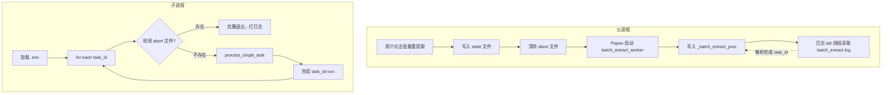
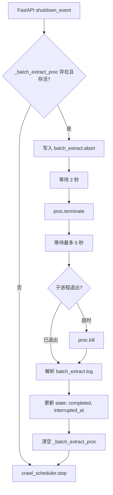
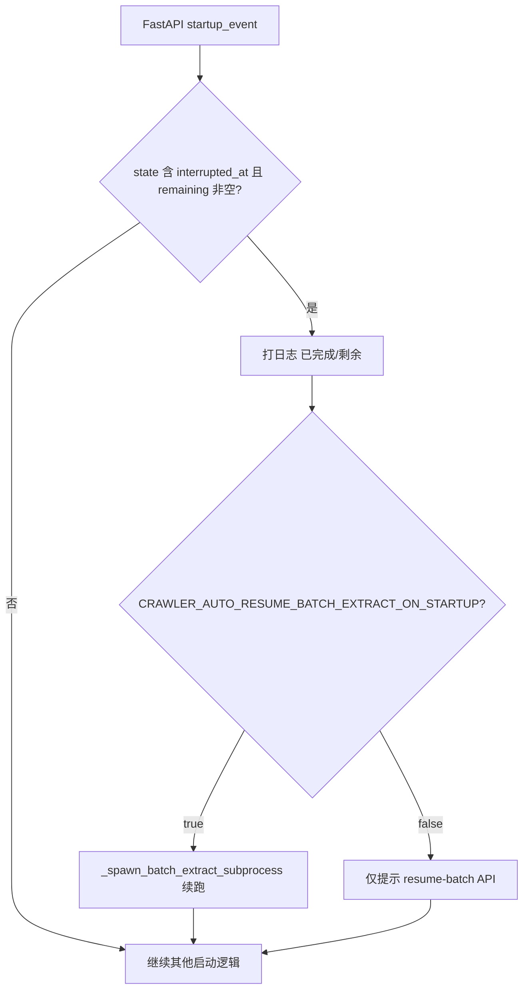
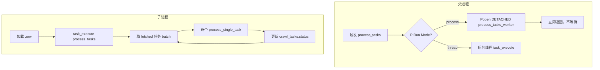
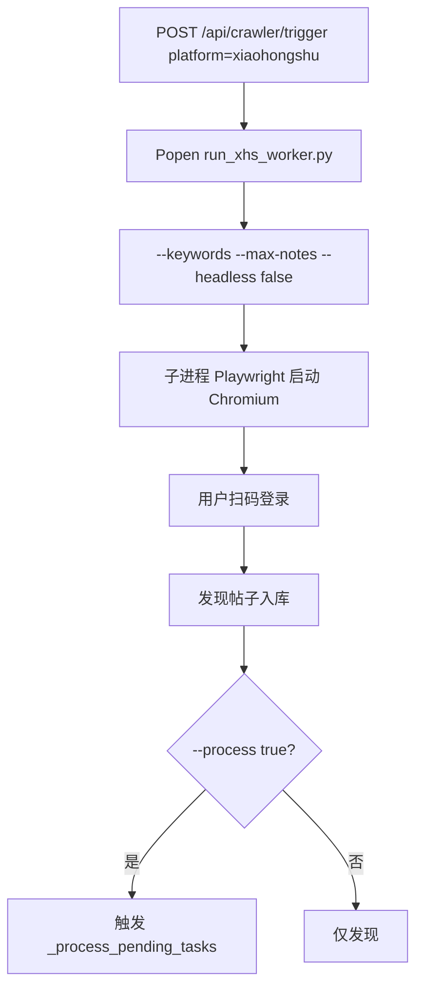
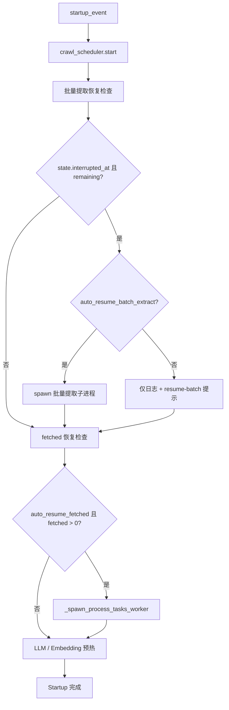
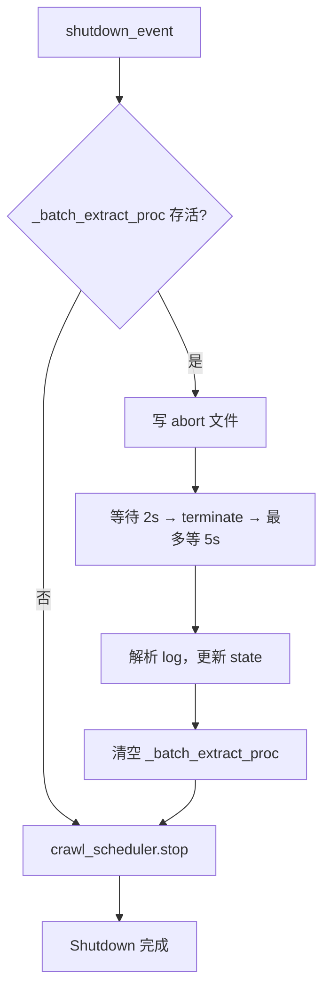

# 进程与子进程架构文档

本文档梳理面经 Agent 后端的**父进程（FastAPI/uvicorn）**与各类**子进程**的职责、启动条件、关闭策略及恢复机制。

**仓库结构总览**：[`docs/README.md`](../README.md)。

---

## 1. 架构概览

```
┌─────────────────────────────────────────────────────────────────────┐
│                        父进程 (uvicorn / FastAPI)                      │
│  - 提供 HTTP API                                                      │
│  - 调度器 (APScheduler)                                                │
│  - Startup / Shutdown 生命周期                                         │
└─────────────────────────────────────────────────────────────────────┘
         │                    │                    │                    │
         ▼                    ▼                    ▼                    ▼
┌──────────────┐   ┌──────────────┐   ┌──────────────┐
│ XHS 爬虫     │   │ process_tasks │   │ 批量提取      │
│ Worker       │   │ Worker       │   │ Worker       │
│ (run_xhs)    │   │ (fetched→题) │   │ (OCR+Miner)  │
└──────────────┘   └──────────────┘   └──────────────┘
```

| 子进程 | 入口模块 | 触发方式 | 与父进程关系 | 父进程退出后 |
|--------|----------|----------|--------------|--------------|
| XHS 爬虫 | `run_xhs_worker.py` | POST `/api/crawler/trigger` (platform=xiaohongshu) | 独立运行，需弹窗 | 继续运行 |
| process_tasks | `process_tasks_worker` | 定时任务 / startup 恢复 fetched | **DETACHED** | 继续运行 |
| 批量提取 | `batch_extract_worker` | 批量重提取 / 单条重提取 / resume | **受控**（可优雅终止） | 被 terminate |

> **已移除**：Stage2 子进程与 `stage2_pending` MQ 消费链路；数据库启动时会将遗留 `crawl_tasks.status=stage2_pending` 迁回 `fetched` 并清空 `stage2_pending` 表。

---

## 2. 子进程详情

### 2.1 批量提取子进程（Batch Extract Worker）

**职责**：对选定任务执行 OCR + MinerAgent **单阶段**提取，耗时长（视模型与正文长度而定）。

**入口**：`backend.services.scheduling.batch_extract_worker`  
**触发**：

- `POST /api/crawler/tasks/re-extract-batch`：批量重提取
- `POST /api/crawler/tasks/{task_id}/re-extract`：单条重提取
- `POST /api/crawler/tasks/resume-batch`：恢复上次中断的批量

**特性**：

- 父进程持有 `_batch_extract_proc` 句柄
- 使用 **abort 文件**（`batch_extract.abort`）通知子进程优雅退出
- 使用 **state 文件**（`batch_extract_state.json`）持久化进度
- 父进程 shutdown 时会 terminate 子进程并保存已完成 task_id



**Shutdown 流程**：



**Startup 恢复**：

- 默认 **`CRAWLER_AUTO_RESUME_BATCH_EXTRACT_ON_STARTUP=true`**：若 `batch_extract_state.json` 含 `interrupted_at` 且 `remaining` 非空，**自动**再次 `Popen` 批量提取子进程（与 fetched 的自动恢复一致）。
- 设为 `false` 时仅打日志，需手动 `POST /api/crawler/tasks/resume-batch`。

**说明**：主进程日志使用 **loguru**，`logger.info("...%d", x)` 不会按 `%` 格式化；相关启动/关闭日志须用 f-string，否则终端会看到字面量 `%d`。



---

### 2.2 process_tasks 子进程

**职责**：处理 `crawl_tasks.status='fetched'` 的任务，执行 MinerAgent 提取并写入 `questions` 表。

**入口**：`backend.services.scheduling.process_tasks_worker`  
**触发**：

- 按钮：`POST /api/crawler/process`、`POST /api/crawler/retry-errors`、`POST /api/crawler/re-extract-all`
- 定时任务：APScheduler 每 N 分钟（可配置）
- **Startup 恢复**：若 `crawler_auto_resume_fetched_on_startup=true` 且存在 `fetched` 任务，自动启动

**特性**：

- **DETACHED_PROCESS**（Windows）或 `start_new_session=True`（Unix）
- 父进程不持有句柄，不等待子进程
- 父进程退出后子进程继续运行
- 恢复依赖 `crawl_tasks.status` 持久化



**Startup 恢复**：

```mermaid
flowchart TD
    A[Startup] --> B{crawler_auto_resume_fetched_on_startup?}
    B -->|false| Z[跳过]
    B -->|true| C[SELECT COUNT(*) FROM crawl_tasks WHERE status='fetched']
    C --> D{fetched_count > 0?}
    D -->|否| Z
    D -->|是| E[_spawn_process_tasks_worker batch_size=...]
    E --> F[子进程独立运行]
```

---

### 2.3 ~~Stage2 子进程~~（已移除）

原 `stage2_worker` / `stage2_processor` 与 `stage2_pending` 队列消费已删除。库表 `stage2_pending` 仍可能存在于旧库中，启动时会被清空；任务状态 `stage2_pending` 会迁回 `fetched` 以便单阶段重新提取。

---

### 2.4 XHS 爬虫子进程

**职责**：小红书发现任务，需弹出浏览器供用户扫码登录。

**入口**：`backend/services/crawler/run_xhs_worker.py`  
**触发**：`POST /api/crawler/trigger`，`platform=xiaohongshu`

**特性**：

- **非 DETACHED**，`creationflags=0`，在当前控制台运行以便显示输出
- 必须用子进程：从 FastAPI 线程启动 headless=False 的 Chromium 会因 Windows 桌面窗口站问题崩溃
- 父进程退出后子进程通常继续完成扫码流程



---

## 3. 父进程生命周期

### 3.1 Startup 完整流程



### 3.2 Shutdown 完整流程



---

## 4. 关键文件与配置

| 路径/配置 | 用途 |
|-----------|------|
| `backend/logs/batch_extract_state.json` | 批量提取进度（task_ids, completed, interrupted_at） |
| `backend/logs/batch_extract.abort` | 父进程写入，子进程检测到则优雅退出 |
| `backend/logs/batch_extract.log` | 批量提取全量日志 |
| `CRAWLER_BACKGROUND_RUN_MODE` | process / thread，process_tasks 执行模式 |
| `CRAWLER_AUTO_RESUME_FETCHED_ON_STARTUP` | 是否在启动时自动恢复 fetched 任务 |
| `CRAWLER_AUTO_RESUME_BATCH_EXTRACT_ON_STARTUP` | 是否在启动时自动续跑未完成的批量提取（默认 true） |

---

## 5. 恢复 API 速查

| 方法 | 路径 | 说明 |
|------|------|------|
| POST | `/api/crawler/tasks/resume-batch` | 恢复上次 shutdown 中断的批量提取 |

---

## 6. 设计小结

1. **批量提取**：父进程可控、可优雅终止，唯一实现「shutdown 时保存进度、startup 后可恢复」的子进程。
2. **process_tasks**：DETACHED 设计，父进程退出后继续跑完，依赖 DB 状态做恢复。
3. **XHS**：需弹窗，必须子进程，不依赖父进程存活。
